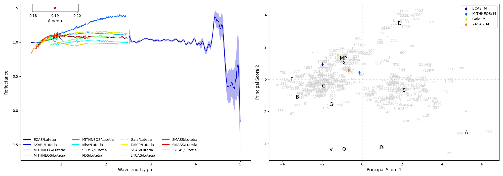
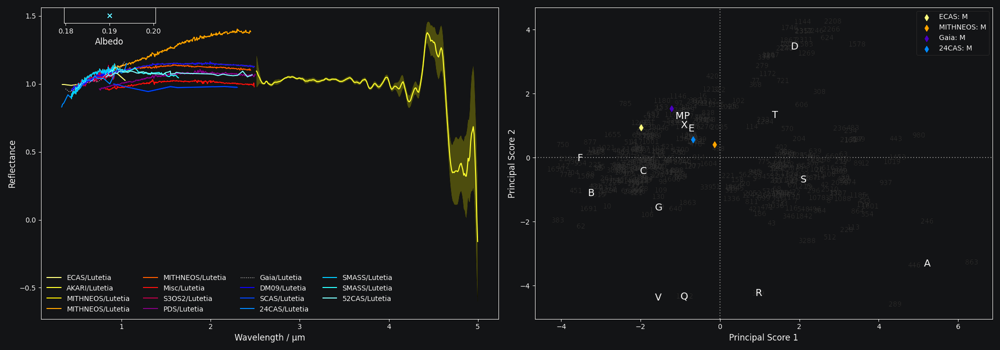

Classifying Spectra
===================

``classy`` can taxonomically classify asteroid spectra and return the
classification results as well as visualize them. Classification results might
be more reliable after :ref:`preprocessing <preprocessing>` the spectra and
:ref:`identifying features <features>` relevant for the class assignment. All
tasks can be done via the command line interface and the ``python`` interface.

.. tab-set::

    .. tab-item:: Command Line

        Classify all available spectra of (21) *Lutetia*.

        .. code-block:: shell

           $ classy classify lutetia
           +---------+--------+----------+----------+--------+--------------+-------------+--------------+-------------------------+
           | name    | number | wave_min | wave_max | albedo | class_mahlke | class_demeo | class_tholen | shortbib                |
           +---------+--------+----------+----------+--------+--------------+-------------+--------------+-------------------------+
           | Lutetia | 21     | 0.337    | 1.041    | 0.19   | K            |             | M            | Zellner+ 1985           |
           | Lutetia | 21     | 2.515    | 4.997    | 0.19   | S            |             |              | Usui+ 2019              |
           | Lutetia | 21     | 0.440    | 2.490    | 0.19   | M            | Xc          |              | Unpublished             |
           | Lutetia | 21     | 0.435    | 2.450    | 0.19   | M            | X           | M            | Unpublished             |
           | Lutetia | 21     | 0.440    | 2.450    | 0.19   | M            | Xc          |              | Unpublished             |
           | Lutetia | 21     | 0.820    | 2.490    | 0.19   | M            |             |              | Ockert-Bell+ 2010       |
           | Lutetia | 21     | 0.501    | 0.920    | 0.19   | L            |             |              | Lazzaro+ 2004           |
           | Lutetia | 21     | 0.752    | 2.501    | 0.19   | M            |             |              | Hardersen+ 2011         |
           | Lutetia | 21     | 0.374    | 1.034    | 0.19   | M            |             | M            | Galluccio+ 2022         |
           | Lutetia | 21     | 0.440    | 2.490    | 0.19   | M            | Xc          |              | DeMeo+ 2009             |
           | Lutetia | 21     | 0.913    | 2.300    | 0.19   | S            |             |              | Clark+ 1995             |
           | Lutetia | 21     | 0.330    | 1.060    | 0.19   | M            |             | M            | Chapman and Gaffey 1979 |
           | Lutetia | 21     | 0.435    | 0.925    | 0.19   | K            |             |              | Bus and Binzel 2002     |
           | Lutetia | 21     | 0.874    | 1.640    | 0.19   | S            |             |              | Burbine and Binzel 2002 |
           | Lutetia | 21     | 0.829    | 2.466    | 0.19   | L            |             |              | Bell+ 1988              |
           +---------+--------+----------+----------+--------+--------------+-------------+--------------+-------------------------+
                                                                 15 Spectra

        By default, this prints a table of available spectra and their classification result.

    .. tab-item:: python

        Classify all available spectra of (21) *Lutetia*.

        .. code-block:: python

           >>> import classy
           >>> spectra = classy.Spectra(21)
           >>> spectra.classify()

        ``classy`` automatically applies the required preprocessing (e.g. normalising,
        resampling) for the respective taxonomic scheme. This happens "under the hood"
        and does not change the ``wave`` and ``refl`` attributes of the ``Spectrum``.

        Iterate over the list of spectra to inspect the classification result:

        .. code-block:: python

           >>> for spec in spectra:
           >>>     print(f"Spectrum of {spec.shortbib} is of class {spec.class_}")

For brevity, the outputs of the remaining examples in this section are not shown. After having completed
the :ref:`Getting Started` section, all shown commands should run on your machine, and you can follow along
by copy-pasting them.

Taxonomy Selection
------------------

Asteroids can be classified in different taxonomic schemes. The chosen scheme
affects the classification procedure (preprocessing steps and classification
logic), the required wavelength range of the spectra, and the classification
output. ``classy`` takes care of the first point, so only the last two points
are relevant for you. You can find an overview of the currently supported
taxonomies and their basic properties :ref:`here <taxonomies>`. To select
the scheme of your choice, use the ``taxonomy`` argument.

+--------------+-----------------------+
| Taxonomy     | Argument Value        |
+--------------+-----------------------+
| Mahlke+ 2022 |  ``mahlke``           |
+--------------+-----------------------+
| DeMeo+ 2009  | ``demeo``             |
+--------------+-----------------------+
| Tholen 1984  | ``tholen``            |
+--------------+-----------------------+

The default value is ``mahlke``.

.. TODO: Add example of classification of spectrum in different schemes, some X type

.. tab-set::

    .. tab-item:: Command Line

        .. code-block:: shell

           $ classy classify vesta --taxonomy demeo

    .. tab-item:: python

        .. code-block:: python

           >>> spectra.classify(taxonomy="demeo")

        The results of the **last** classification is stored in ``class_``. In case you use different schemes for comparison,
        you can access the results using ``class_mahlke``, ``class_demeo``, ``class_tholen``.

        .. code-block:: python

           >>> spectra.classify(taxonomy="demeo")
           >>> spec.class_demeo

If a spectrum cannot be classified in the chosen scheme due to :ref:`insufficient wavelength coverage <taxonomies>`, a warning is printed
and the resulting class is an empty string ``""``.\ [#f1]_
Classification by-products like principal component scores and class probabilities are also available depending on the chosen taxonomy.
The products of each scheme can be found in the relevant sections of the :ref:`overview <taxonomies>`.

All implemented schemes benefit from knowing the albedo of the target. For ``mahlke`` and ``tholen``, this heavily
influences the resulting classification. For ``demeo``, ``classy`` uses the albedo to resolve branches of the original decision tree
that are unresolved in DeMeo+ 2009, in case the classes are reliably different in albedo (e.g. D and S).

A ``classy.Spectrum`` can be classified following different taxonomies using the ``.classify()``
function. The ``taxonomy`` argument can be used to choose between different taxonomies.

.. code-block:: python

   >>> import classy
   >>> ceres = classy.Spectra(1, source='Gaia')[0]
   >>> ceres.classify() # taxonomy='mahlke' is default
   >>> ceres.classify(taxonomy='tholen') # Tholen 1984 (requires extrapolation)
   >>> ceres.classify(taxonomy='demeo') # DeMeo+ 2009 (fails due to wavelength range)

The resulting class is added as ``class_`` attribute to the spectrum. For
``tholen`` and ``demeo``, the attributes are ``class_tholen`` and
``class_demeo`` respectively. Further added attributes depending on the chosen
taxonomy are described in the :ref:`taxonomies <available_taxonomies>` section.

Visualizing the Result
----------------------

Passing the ``taxonomy`` argument to the ``plot`` method of the ``Spectrum`` and ``Spectra``
classes adds a second panel next to the spectra showing the classification result. If ``taxonomy="mahlke"``
is set, the results shows the class probabilities for each spectrum.

If ``taxonomy="demeo"`` or ``taxonomy="tholen"``, it shows the projection of
the spectra into the space spanned by the first and second principal components
of the respective taxonomies.

.. code-block:: python

    >>> spectra = classy.Spectra(21)
    >>> spectra.classify(taxonomy='tholen')
    >>> spectra.plot(taxonomy='tholen')

On the command line, the classification results can be visualised by specifying
the ``--plot`` flag. Use the ``--taxonomy`` argument to provide the desired taxonomic scheme.

.. code-block:: python

    $ classy classify 13 --plot --taxonomy demeo

.. _exporting_spectra:

Exporting the Result
--------------------

Both ``Spectrum`` and ``Spectra`` have an ``export`` method which can be used
to store any of their attributes to a ``csv`` file. By default, the ``Spectrum.export``
method stores the spectral data (wavelength, reflectance), while the ``Spectra.export``
method stores metadata attributes like the classification results, bibliography, or filenames.
The usage of the ``Spectrum.export`` method is described :ref:`here <exporting_spectrum>`.

The ``Spectra.export`` method expects a ``filename`` as mandatory argument. The
attributes to export can be specified using the optional ``columns`` argument.
By default,\ [#f2]_

.. code-block:: python

   columns = ['name', 'target.name', 'class_mahlke', 'class_demeo', 'class_tholen', 'filename']

Other columns of interest could be the presence of features or their parameters or the class probabilities following the Mahlke
taxonomy (see :ref:`here <mahlke>`):

.. code-block:: python

   columns = ['target.name', 'class_mahlke', 'class_Q',  'class_S', 'h.is_present', 'h.center', 'shortbib']

Let's see this in action:

.. code-block:: python

   >>> import classy
   >>> spectra = classy.Spectra(214)
   >>> spectra.classify()
   >>> spectra.classify(taxonomy='demeo')
   >>> spectra.classify(taxonomy='tholen')
   >>> spectra.export('class_aschera.csv')

which gives

.. code-block:: shell

   $ cat class_aschera.csv
   name,target.name,class_mahlke,class_demeo,class_tholen,filename
   ECAS/Aschera,Aschera,E,,E,pds/gbo.ast.ecas.phot/data/214.csv
   Misc/Aschera,Aschera,E,,,pds/gbo.ast-mb.reddy.spectra/data/2006/214_aschera.tab
   S3OS2/Aschera,Aschera,E,,,pds/EAR_A_I0052_8_S3OS2_V1_0/data/n00166_n00307/00214_aschera.tab
   Gaia/Aschera,Aschera,E,,E,gaia/part05/aschera.csv
   DM09/Aschera,Aschera,E,,E,demeo2009/a000214.sp33.txt
   Misc/Aschera,Aschera,E,,,pds/gbo.ast.irtf-spex-collection.spectra/data/clarketal2004/214_030816t055017.tab
   SMASS/Aschera,Aschera,S,,,smass/smass2/a000214.[2]

The only practical difference between ``Spectrum.export`` and
``Spectra.export`` is thus the default value of the ``columns`` argument. You
can export the the classification results of a single ``Spectrum`` by
specifying the ``columns`` argument:

.. code-block:: python

   >>> spec.export("44_nysa_smoothed.csv", columns=["name", "target.name", "class_mahlke", "class_demeo", "class_tholen", "filename"])

To export the spectral data of many ``Spectra``, run the ``Spectrum.export`` method in a loop:

.. code-block:: python

   >>> for spec in spectra:
   ...     spec.export(f"{spec.name}.csv")

.. rubric:: Footnotes
   :caption:

.. [#f1] If the missing part represents less than a given limit, the spectrum will be extrapolated linearly to cover the required range for classification. This is most useful for the Gaia DR3 spectra (0.374 - 1.034μm) and the Tholen taxonomy (0.337 - 1.041µm). More on this limit and its configuration can be found :ref:`here <extrapolation_limit>`.

.. [#f2] The ``name`` attribute represents the ``source`` of the spectrum and the name of its target, if specified, e.g. ``Gaia/Lutetia``.
