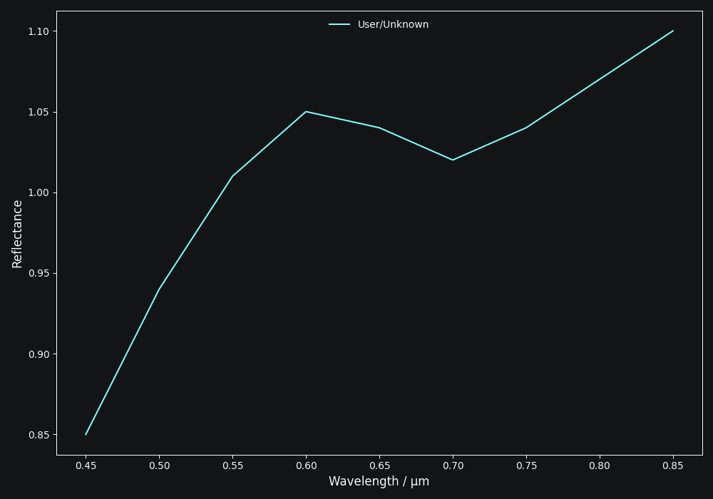
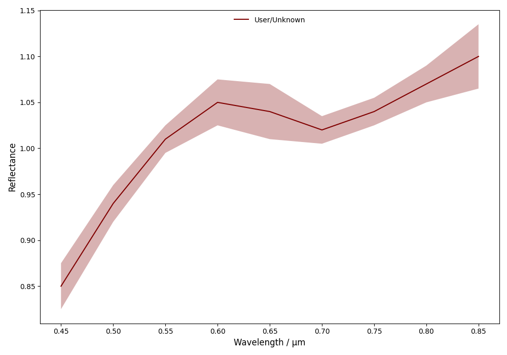
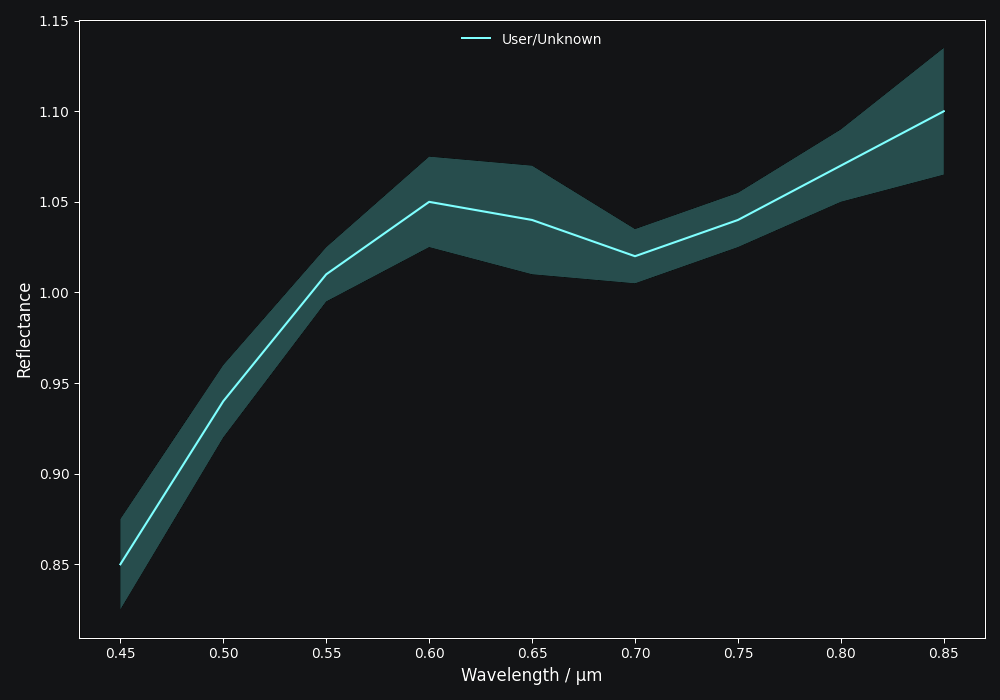
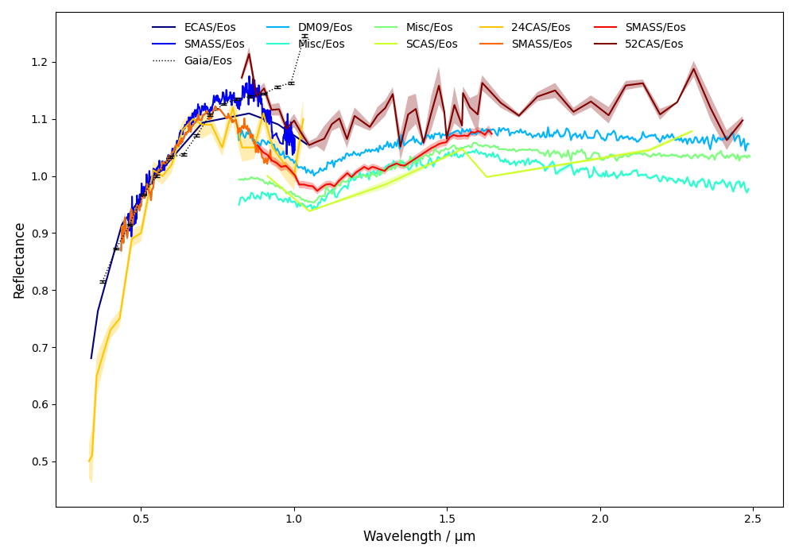
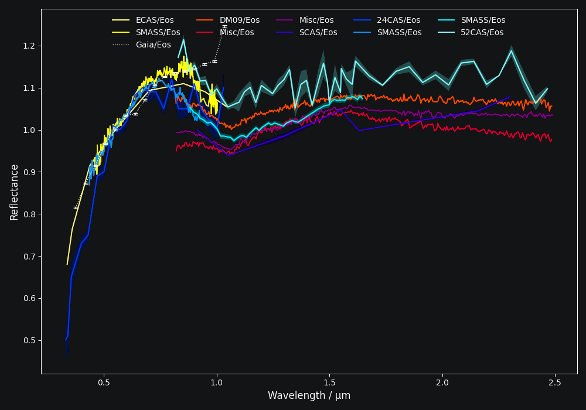
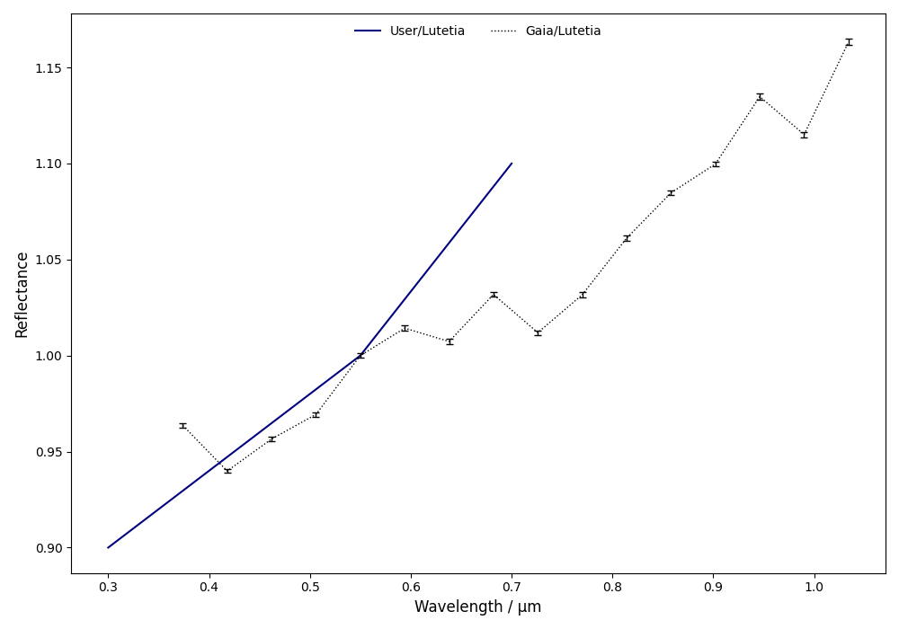
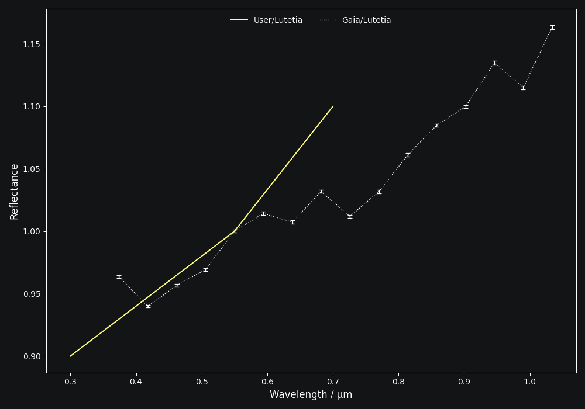
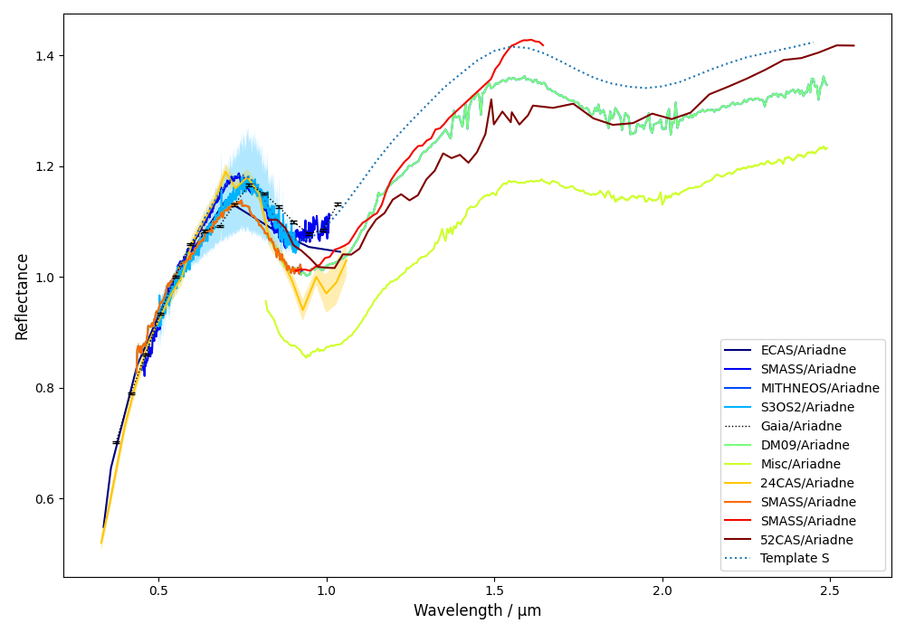
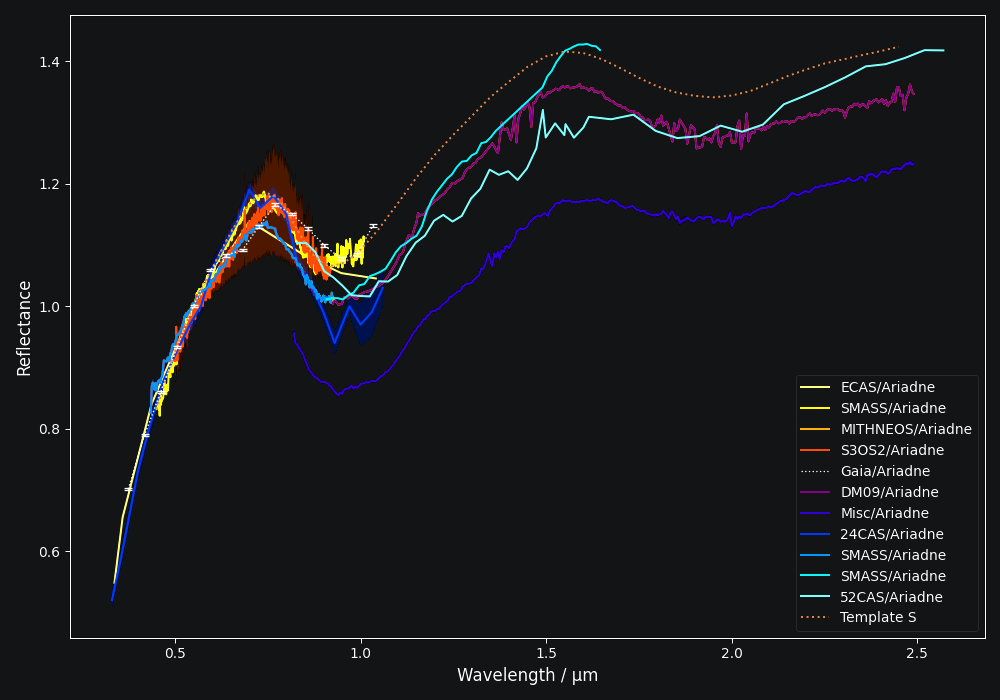

:tocdepth: 3

.. _core:

Basic Usage
===========

``classy`` is a tool for the analysis of reflectance spectra. Every spectrum is
represented the ``Spectrum`` class. This class stores the data and metadata of
the spectrum and its target. You can build a spectrum in two ways: by providing
your own data or by retrieving data from :ref:`public repositories<public_data>`.

.. _getting_data:

Creating a ``Spectrum``
-----------------------

To create a ``Spectrum``, you require a list of wavelength values and a list of
reflectance values:

.. code-block:: python

  >>> import classy
  >>> # Define dummy data
  >>> wave = [0.45, 0.5, 0.55, 0.6, 0.65, 0.7, 0.75, 0.8, 0.85]
  >>> refl = [0.85, 0.94, 1.01, 1.05, 1.04, 1.02, 1.04, 1.07, 1.1]
  >>> spec = classy.Spectrum(wave=wave, refl=refl)

Let's have a look at this spectrum.

.. code-block:: python

   >>> spec.plot()

.. image:: gfx/core/spectrum.png
 :align: center
 :class: only-light
 :width: 600

The plot legend gives the source and the target name for each spectrum, as explained below.
As we have not yet set a target, it is shown as "Unknown".

Besides the mandatory ``wave`` and ``refl`` arguments, there are optional
arguments with a pre-defined meaning to ``classy``. For example, the
``refl_err`` attribute contains the reflectance errors.

.. code-block:: python

   >>> refl_err = [0.05, 0.04, 0.03, 0.05, 0.06, 0.03, 0.03, 0.04, 0.07]
   >>> spec = classy.Spectrum(wave=wave, refl=refl, refl_err=refl_err)
   >>> spec.plot()

``classy`` automatically adds the error bars to the plot as it recognises the
``refl_err`` attribute. You can find a list of all mandatory and optional
arguments with a pre-defined meaning for ``classy`` below.

.. _predefined_keywords:

+---------------------+---------------------+---------------------------------------------------------------------------------------------------------------------------------------------------------+
| Parameter           | Accepted values     | Explanation                                                                                                                                             |
+---------------------+---------------------+---------------------------------------------------------------------------------------------------------------------------------------------------------+
| ``wave``            | ``list of float``   | The wavelength bins of the spectrum **in micron**.                                                                                                      |
+---------------------+---------------------+---------------------------------------------------------------------------------------------------------------------------------------------------------+
| ``refl``            | ``list of float``   | The reflectance values of the spectrum.                                                                                                                 |
+---------------------+---------------------+---------------------------------------------------------------------------------------------------------------------------------------------------------+
| ``refl_err``        | ``list of float``   | The uncertainty of the reflectance values of the spectrum.                                                                                              |
+---------------------+---------------------+---------------------------------------------------------------------------------------------------------------------------------------------------------+
| ``date_obs``        | ``str``             | Observation epoch of the spectrum in `ISOT format <https://en.wikipedia.org/wiki/ISO_8601>`_:                                                           |
|                     |                     | ``YYYY-MM-DDTHH:MM:SS``.                                                                                                                                |
+---------------------+---------------------+---------------------------------------------------------------------------------------------------------------------------------------------------------+
| ``phase``           | ``float``           | The phase angle at the epoch of observation in degree.                                                                                                  |
+---------------------+---------------------+---------------------------------------------------------------------------------------------------------------------------------------------------------+
| ``target``          | ``str`` or ``int``  | Name, number, or designation of the asteroidal target of the observation.\ [#f1]_                                                                       |
+---------------------+---------------------+---------------------------------------------------------------------------------------------------------------------------------------------------------+
| ``source``          | ``str``             | Short string representing the source of the spectrum. Default is 'User'.                                                                                |
+---------------------+---------------------+---------------------------------------------------------------------------------------------------------------------------------------------------------+

You can specify these when creating the ``Spectrum`` or at a later point via
the dot-notation. All attributes can be accessed and edited via the
dot-notation.

.. code-block:: python

  >>> spec.date_obs = '2020-02-01T00:00:00'  # adding metadata to existing spectrum
  >>> print(f"Spectrum acquired on {spec.date_obs}.")  # accessing metadata via the dot-notation
  Spectrum acquired on 2020-02-01T00:00:00.

Any other arguments you pass to ``classy.Spectrum`` or set via the dot-notation
are automatically added to the ``Spectrum``, which is useful to define metadata
relevant for your analysis, such as flags.\ [#f2]_

.. code-block:: python

  >>> wave = [0.45, 0.5, 0.55, 0.6, 0.65, 0.7, 0.75, 0.8, 0.85]
  >>> refl = [0.85, 0.94, 1.01, 1.05, 1.04, 1.02, 1.04, 1.07, 1.1]
  >>> flags = [1, 0, 0, 0, 0, 0, 0, 1, 2]
  >>> spec = classy.Spectrum(wave=wave, refl=refl, flags=flags)

Assigning a Target
++++++++++++++++++

Spectra in ``classy`` are typically associated to a minor body. You can specify
the target of the observation or setting the ``target`` argument when
instantiating the ``Spectrum`` instance (see table above) or by calling the
``set_target()`` method. Both require the name, number, or designation of the
target. ``classy`` then resolves the target's identity using `rocks
<https://rocks.readthedocs.io/>`_ and retrieve its physical and dynamical
properties, making them accessible via the ``target`` attribute. ``classy``
makes use of this information in various ways, therefore, it is generally
beneficial to specify the target.

.. code-block:: python

   >>> spec.set_target('vesta')  # Assigns rocks.Rock instance to spec.target
   >>> print(spec.target)
   Rock(number=4, name='Vesta')
   >>> print(spec.target.number)
   4
   >>> print(spec.target.albedo.value)
   0.380
   >>> print(spec.target.class_)
   'MB>Inner'

For example, if both the target and the observation date ``date_obs`` of a ``Spectrum`` are
provided, ``classy`` can query the phase angle at the time of observation from
the `Miriade <https://ssp.imcce.fr/webservices/miriade/>`_ webservice and make it accessible
via the ``phase`` attribute.

.. code-block:: python

   >>> spec.date_obs = '2010-07-01T22:00:00'
   >>> spec.compute_phase_angle()
   >>> print(f"{spec.target.name} was observed on {spec.date_obs} at a phase angle of {spec.phase:.2f}deg")
   Vesta was observed on 2010-07-01T22:00:00 at a phase angle of 23.63deg

.. Note::

   ``classy`` separates properties of the spectrum and properties of the
   target. ``spec.name`` is the name of the spectrum, ``spec.target.name`` is
   the name of the target. Similarly, properties like the albedo are accessed
   via the target: ``spec.target.albedo.value``.

Working with ``Spectra``
------------------------

``classy`` is connected to several :ref:`public repositories <public_data>` of asteroid reflectance spectra. The ``Spectra`` class
allows to query these repositories for spectra matching a wide range of criteria to ingest them into your analysis (or just to have a look around, which is fun, too).
For example, you can query all databases for any spectra of an asteroid by providing its name or number.

.. code-block:: python

  >>> spectra = classy.Spectra(221)  # look up spectra of (221) Eos
  >>> print(f"Found {len(spectra)} spectra of (221) Eos")
  Found 11 spectra of (221) Eos
  >>> spectra.plot()

The ``Spectra`` class is essentially a list of ``Spectrum`` instances. You can
the usual ``python`` indexing and iteration operations to access the individual
spectra.

.. code-block:: python

    >>> for spec in spectra:
    ...     print(f"{spec.source:>6} {spec.shortbib:>15} [{spec.wave.min():.3f}-{spec.wave.max():.3f}]")
     ECAS   Zellner+ 1985 [0.337-1.041]
    SMASS        Xu+ 1995 [0.457-1.002]
     Gaia Galluccio+ 2022 [0.374-1.034]
     DM09     DeMeo+ 2009 [0.435-2.485]
     Misc     Clark+ 2009 [0.820-2.485]
     Misc     Clark+ 2009 [0.820-2.490]
     SCAS     Clark+ 1995 [0.913-2.300]
    >>> eos_gaia = spectra[2]
    >>> print(eos_gaia.shortbib)
    Galluccio+ 2022

More examples and advanced query criteria are outlined in the :ref:`Selecting Spectra <selecting_spectra>` chapter.

All literature spectra have their corresponding target assigned automatically.

  >>> spectra = classy.Spectra(shortbib="Morate+ 2016")
  >>> for spec in spectra[:5]:  # only print 5, Morate+ 2016 observed many more
  ...     print(spec.target.name)
  2001 DC6
  2003 YY12
  1999 NE28
  2000 YZ6
  1999 FG51

Besides the attributes of the ``Spectrum`` class given in the table above, all
public spectra further have the attributes below relating to their
bibliography, while additional attributes are available on a per-source basis,
as given in the :ref:`individual repository descriptions <public_data>`.

+------------------------------+---------------------------------------------------------------------------------------------------------------------+
| Attribute                    | Description                                                                                                         |
+------------------------------+---------------------------------------------------------------------------------------------------------------------+
| ``shortbib``                 | Short version of reference of the spectrum.                                                                         |
+------------------------------+---------------------------------------------------------------------------------------------------------------------+
| ``bibcode``                  | Bibcode of reference publication of the spectrum.                                                                   |
+------------------------------+---------------------------------------------------------------------------------------------------------------------+
| ``source``                   | String representing the source of the spectrum (e.g. ``'24CAS'``).                                                  |
+------------------------------+---------------------------------------------------------------------------------------------------------------------+

Dates of Observations
+++++++++++++++++++++

*A lot* of effort further went into extracting the ``date_obs`` parameters of
public spectra from the literature and storing them in `ISOT format
<https://en.wikipedia.org/wiki/ISO_8601>`_: ``YYYY-MM-DDTHH:MM:SS``. If the
literature does not provide the ``date_obs``, it is set to an empty string:
``""``. If the time of the day is not know, ``HH:MM:SS`` is set to
``00:00:00``.  If the spectrum is an average of observations at different
dates, all dates are given, separated by a ``,``, e.g.
``2004-03-02T00:00:00,2004-05-16T00:00:00``.

Combining a ``Spectrum`` with many ``Spectra``
++++++++++++++++++++++++++++++++++++++++++++++

You can combine your observations (``Spectrum`` instances) with observations from the literature (``Spectra``)
by simply adding them.

.. code-block:: python

    >>> my_lutetia = classy.Spectrum(wave=[0.3, 0.4, 0.55, 0.7], refl=[0.9, 0.94, 1, 1.1], target="Lutetia")
    >>> lutetia_literature = classy.Spectra(21, source='Gaia')
    >>> lutetia_spectra = my_lutetia + lutetia_literature  # add my_lutetia to the literature results
    >>> lutetia_spectra.plot()

.. Given that they are so numerous, Gaia spectra have a unique display style in
.. ``classy``, color-coding the ``flag`` value of the different wavelength bins
.. (``0`` = black, ``1`` = orange, ``2`` = red).

The benefit of combining them in a single ``Spectra`` instance is that most operations that can be done
on a ``Spectrum`` (e.g. preprocessing, feature detection, see later chapters) can be done on a large number of ``Spectra`` by simply calling the
corresponding function of the ``Spectra`` class. This saves efforts in typing and is useful when :ref:`plotting
and exporting <export>` analysis results.

Plotting ``Spectra``
--------------------

This chapter already demonstrated taht you can use the ``plot`` method of the
``Spectrum`` and ``Spectra`` classes to visualise the spectra. The method
returns the ``matplotlib`` ``Figure`` and ``axis`` instances. If you want to
adapt the figure before opening the plot, you can set ``show=False``. This can
be useful e.g. if you would like to add :ref:`template spectra of taxonomic
classes <taxonomies>` for comparison.

.. code-block::

  >>> import matplotlib.pyplot as plt
  >>> spectra = classy.Spectra(43)
  >>> fig, ax = spectra.plot(show=False)
  >>> templates = classy.taxonomies.mahlke.load_templates()
  >>> ax.plot(templates['S'].wave, templates['S'].refl, label='Template S', ls=":")
  >>> ax.legend()
  >>> plt.show()

You can save the figure to file by specifying the output filename with the ``save`` argument.

.. code-block::

  >>> spectra.plot(save="43_with_mahlke_s_template.png")

.. _exporting_spectrum:

Exporting a ``Spectrum``
------------------------

You can use the ``export`` method of the ``Spectrum`` class to export the
spectral data.

By default, ``classy`` will write the current values of the ``wave``, ``refl``,
and (if not ``None``) ``refl_err`` values to a ``csv`` file and save it under the provided
``path``, the mandatory argument of the ``export`` function.

.. code-block::

   >>> spec.export("44_nysa_smoothed.csv")

You can specify which attributes to export by passing a list of attribute names to the ``columns`` argument.
By default, this list is ``['wave', 'refl', 'refl_err']``. All attributes must have the same length.

.. code-block::

   >>> spect.export("44_nysa_smoothed.csv", columns=['wave', 'refl', 'flag'])

To get the original data of the spectrum,  set ``raw=True``. In this case, ``classy``
copies the data file of the spectrum from the ``classy`` data directory to the specified paths.
The ``columns`` argument is ignored if ``raw=True``.

.. code-block::

   >>> spec.export("44_nysa_original.csv", raw=True)

The ``export`` method of the ``Spectra`` class behaves differently and is explained :ref:`later on <exporting_spectra>`.

.. rubric:: Footnotes
   :caption:

.. [#f1] The string or integer you pass to the ``target`` argument is replaced by the ``rocks.Rock`` instance of the resolved target: ``type(spec.target)`` -> ``rocks.Rock``.

.. [#f2] With great power comes great responsibility: ``classy`` verifies the wavelength and reflectance values you pass and possibly adapts their shape, but it does not apply checks on optional arguments. You can find out more about the verification and possible pitfalls :ref:`here <sanity_checks>`.
