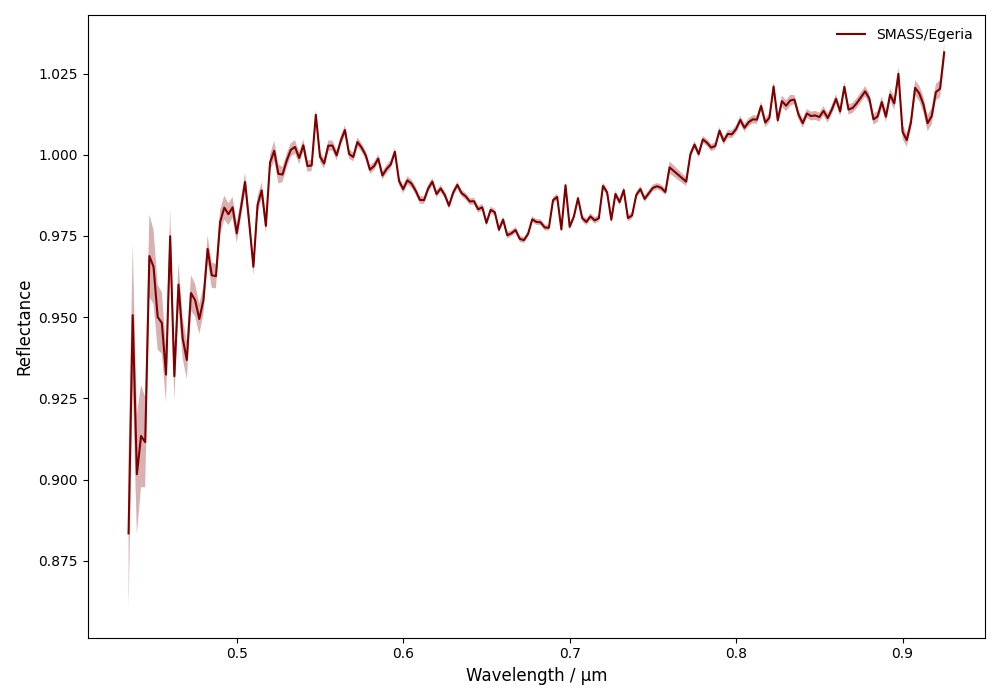
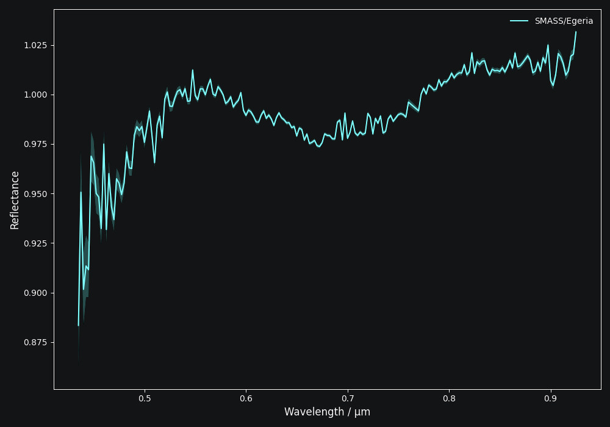
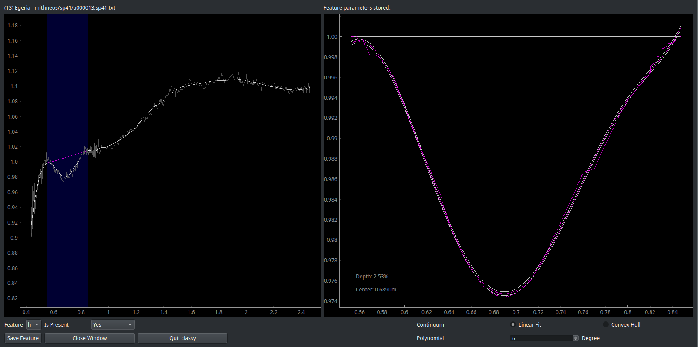

.. _features:

Features
========

A number of taxonomic classes have secondary characters to signal the presence of certain spectral features,
such as ``Ch``, ``Xk``, ``Xn``, ``Ee``. The presence or absence of these features must therefore be determined prior
to taxonomic classification.

``classy`` recognises three spectral absorption features as taxonomically
relevant: ``e``, ``h``, and ``k``. They are defined in `Mahlke, Carry, and
Mattei 2022 <https://arxiv.org/abs/2203.11229>`_. Example spectra presenting the features are shown below.

.. image:: gfx/features/feature_flags.png
    :align: center
    :class: only-light
    :width: 600

.. image:: gfx/features/feature_flags_dark.png
    :align: center
    :class: only-dark
    :width: 600

Inspection
----------

Let's take this spectrum of (13) *Egeria* from Bus and Binzel 2002 as an example.

.. code-block:: python

   >>> import classy
   >>> spectra = classy.Spectra(13, shortbib="Bus and Binzel 2002")
   >>> spec = spectra[0]  # Select first spectrum from list
   >>> spec.plot()

Each spectrum in ``classy`` has the ``e``, ``h``, and ``k`` attributes which
represent the absorption features. Each feature has three different attributes
which represent its presence or absence:

- ``is_covered``: ``True`` if the spectrum covers the feature wavelength range, else ``False``
- ``is_candidate``: ``True`` if ``is_covered`` but the band has not been inspected yet by the user, else ``False``
- ``is_present``: ``True`` if the presence of the band has been visually confirmed by the user, else ``False``

This means that, by default, ``classy`` assumes that all features are absent in a given spectrum. However, it automatically
determines whether the feature range is covered by the spectrum.

.. code-block:: python

   >>> spec.e
   <Feature e>
   >>> spec.e.is_covered
   True
   >>> spec.h
   <Feature h>
   >>> spec.h.is_covered
   True
   >>> spec.h.is_candidate
   True
   >>> spec.h.is_present
   False
   >>> spec.k
   <Feature k>
   >>> spec.k.is_covered
   False
   >>> spec.k.is_candidate
   False

We see that the spectrum of (13) *Egeria* covers the ``e`` and ``h`` but not ``k``. ``k`` is not a candidate
and ``classy`` will exclude from any of the steps below automatically.

The ``h`` feature is present in the spectrum but ``classy`` does not know it yet. It remains a ``is_candidate`` spectrum.
The same is true for the ``e`` feature, although we can see that it is not present. To change this, we have to visually
inspect the features and store the decision in the ``classy`` feature index.

.. tab-set::

   .. tab-item:: Command Line

      Use the ``features`` command to inspect features in any number of spectra. You select the spectra
      using the :ref:`spectra selection syntax <selecting_spectra>`.
      Only spectra that cover the feature wavelength ranger will be included.
      The spectra will be smoothed before if smoothing parameters are in the preprocessing index.

      .. code-block:: shell

         $ classy features --shortbib "Morate+ 2016"

      Unlike in the general syntax, the ``feature`` keyword here serves to
      select one or many of the features to fit.

      .. code-block:: shell

         $ classy features --shortbib "Morate+ 2016" --feature h
         $ classy features --shortbib "Morate+ 2016" --feature e,k

      By default, features that have already been inspected are skipped.
      Use the ``force`` argument to override this behaviour.

      .. code-block:: shell

         $ classy features --shortbib "Morate+ 2016" --force

      This will open the interactive fitting interface that is shown below.

   .. tab-item:: python

      You can request to inspect features at different levels of the ``classy`` hierarchy:

      .. code-block:: python

         >>> spectra = classy.Spectra(shortbib="Morate+ 2016")
         >>> spectra.inspect_features()  # inspect all features of all spectra
         >>> spec = spectra[0]
         >>> spec.inspect_features()  # inspect all features of this spectrum
         >>> spec.h.inspect()  # inspect the h feature of this spectrum

      When using ``inspect_features``, only spectra that cover the feature
      wavelength ranger will be included.
      The spectra will be smoothed before if smoothing parameters are in the preprocessing index.

      You can select the feature to fit using the ``feature`` argument.

      .. code-block:: python

         >>> spectra.inspect_features(feature=['h', 'k'])

      By default, features that have already been inspected are skipped.
      Use the ``force`` argument to override this behaviour.

      .. code-block:: python

         >>> spectra.inspect_features(force=True)

      This will open the interactive fitting interface that is shown below.

Analysis
--------

Once you have fit a feature, the fit properties are available as attributes.

.. code-block:: python

    >>> spec.h.is_present
    True
    >>> spec.h.center
    0.6904584561717655
    >>> spec.h.depth
    2.705244585887634  # in percent

The inspection results are stored in the feature index. When you load the same spectrum
in another analysis, ``classy`` sets all relevant feature attributes and marks the spectrum directly
as inspected.

.. admonition:: Reproducibility

  The feature index makes it easy to share your work and results with other users of ``classy``.
  This increases reproducibility and prevents two people from having to inspect the same spectra.
  Instructions on how to share parts of your feature index are given in the :ref:`Appendix <share_features>`.
