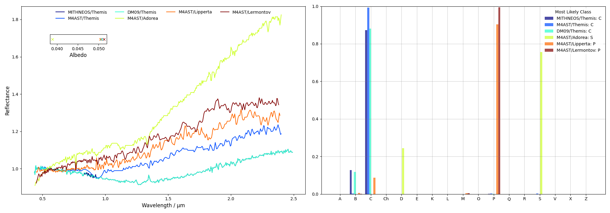
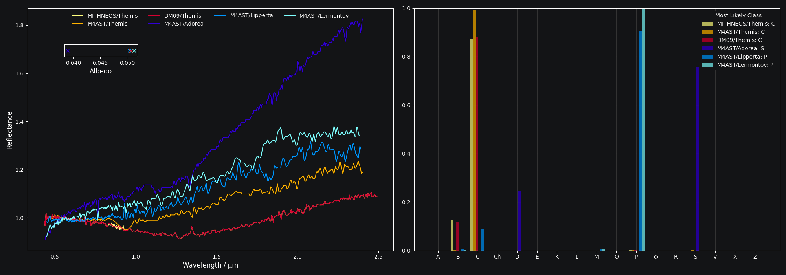

##########
``classy``
##########

.. |br| raw:: html

      

.. raw:: html

    

.. role:: gray

A tool to explore, download, analyse, and classify asteroid reflectance spectra. Originally designed for classification in the taxonomy of
`Mahlke, Carry, and Mattei 2022 <https://arxiv.org/abs/2203.11229>`_, it now offers multiple taxonomic systems and a suite of qualitfy-of-life features
for spectroscopic analysis.\ [#f1]_

|br|

.. grid:: 2

    .. grid-item-card::  Classify Your Observation →
      :text-align: center
      :link: https://classy.streamlit.app

      Using the ``classy`` web interface.

    .. grid-item-card:: Get started →
      :text-align: center
      :link: getting_started
      :link-type: ref

      Install and use ``classy`` on your machine.

.. highlight:: python

|br|

Showcase
++++++++

Things that ``classy`` tries to do well.

|br|

:octicon:`telescope;1em` **Explore and compare.**

Quickly find and download spectra in public repositories.

*Example*: List all spectra of asteroids in the Themis family with albedos up to 0.06 that cover the 0.45-1.8μm range.

.. tab-set::

   .. tab-item:: Command Line

        .. code-block:: shell

           $ classy spectra --wave_min 0.45 --wave_max 1.8 --family Themis --albedo ,0.06
           +-----------+--------+----------+----------+--------+---------------------+--------+--------+-----------------+
           | name      | number | wave_min | wave_max | phase  | date_obs            | family | albedo | shortbib        |
           +-----------+--------+----------+----------+--------+---------------------+--------+--------+-----------------+
           | Themis    | 24     | 0.435    | 2.49     | 12.917 | 2005-10-08T05:28:30 | Themis | 0.051  | MITHNEOS Unpub. |
           | Themis    | 24     | 0.45     | 2.4      | -      | -                   | Themis | 0.051  | Fornasier+ 2016 |
           | Themis    | 24     | 0.435    | 2.49     | 12.876 | 2005-10-08T00:00:00 | Themis | 0.051  | DeMeo+ 2009     |
           | Adorea    | 268    | 0.44     | 2.4      | -      | -                   | Themis | 0.039  | Fornasier+ 2016 |
           | Lipperta  | 846    | 0.45     | 2.39     | -      | -                   | Themis | 0.05   | Fornasier+ 2016 |
           | Lermontov | 2222   | 0.45     | 2.38     | -      | -                   | Themis | 0.051  | Fornasier+ 2016 |
           +-----------+--------+----------+----------+--------+---------------------+--------+--------+-----------------+
                                                                6 Spectra

   .. tab-item:: python

        .. code-block:: python

           >>> import classy
           >>> spectra = classy.Spectra(wave_min=0.45, wave_max=1.8, family="Themis", albedo=",0.06")
           >>> print(f"Found {len(spectra)} spectra from {[spec.shortbib for spec in spectra]}.")
           Found 6 spectra from ['MITHNEOS Unpub.', 'Fornasier+ 2016', 'DeMeo+ 2009', 'Fornasier+ 2016', 'Fornasier+ 2016', 'Fornasier+ 2016'].

   .. tab-item:: Online

        Coming soon.

:octicon:`beaker;1em` **Analyse and classify.**

Persistent preprocessing and feature recognition for quick classification.

*Example*: Classify the spectra above following Mahlke+ 2022, DeMeo+ 2009, and Tholen 1984.

.. tab-set::

   .. tab-item:: Command Line

        .. code-block:: shell

            $ classy classify --wave_min 0.45 --wave_max 1.8 --family Themis --albedo ,0.06
            +-----------+--------+----------+----------+--------+--------------+-------------+--------------+-----------------+
            | name      | number | wave_min | wave_max | albedo | class_mahlke | class_demeo | class_tholen | shortbib        |
            +-----------+--------+----------+----------+--------+--------------+-------------+--------------+-----------------+
            | Themis    | 24     | 0.435    | 2.490    | 0.0507 | C            | C           | G            | MITHNEOS Unpub. |
            | Themis    | 24     | 0.450    | 2.400    | 0.0507 | C            | C           |              | Fornasier+ 2016 |
            | Themis    | 24     | 0.435    | 2.490    | 0.0507 | C            | C           | G            | DeMeo+ 2009     |
            | Adorea    | 268    | 0.440    | 2.400    | 0.0389 | S            |             |              | Fornasier+ 2016 |
            | Lipperta  | 846    | 0.450    | 2.390    | 0.0504 | P            | X           |              | Fornasier+ 2016 |
            | Lermontov | 2222   | 0.450    | 2.380    | 0.0513 | P            | C           |              | Fornasier+ 2016 |
            +-----------+--------+----------+----------+--------+--------------+-------------+--------------+-----------------+
                                                                 6 Spectra

   .. tab-item:: python

        .. code-block:: python

           >>> spectra.classify(taxonomy="mahlke")
           >>> spectra.classify(taxonomy="demeo")
           >>> spectra.classify(taxonomy="tholen")
           >>> for spec in spectra:
           ...     print(f"{spec.name} is {spec.class_mahlke} in Mahlke+ 2022, {spec.class_demeo} in DeMeo+ 2009, and {spec.class_tholen} in Tholen 1984")
           MITHNEOS/Themis is C in Mahlke+ 2022, C in DeMeo+ 2009, and G in Tholen 1984
           M4AST/Themis is C in Mahlke+ 2022, C in DeMeo+ 2009, and  in Tholen 1984
           DM09/Themis is C in Mahlke+ 2022, C in DeMeo+ 2009, and G in Tholen 1984
           M4AST/Adorea is S in Mahlke+ 2022,  in DeMeo+ 2009, and  in Tholen 1984
           M4AST/Lipperta is P in Mahlke+ 2022, X in DeMeo+ 2009, and  in Tholen 1984
           M4AST/Lermontov is P in Mahlke+ 2022, C in DeMeo+ 2009, and  in Tholen 1984

   .. tab-item:: Online

        Coming soon.

:octicon:`zap;1em` **Visualise and export.**

Quick-look plots at any step to verify your analysis.

*Example*: Show the spectra and the classification results.

.. tab-set::

   .. tab-item:: Command Line

        .. code-block:: shell

            $ classy classify --wave_min 0.45 --wave_max 1.8 --family Themis --albedo ,0.06 --plot

   .. tab-item:: python

        .. code-block:: python

            >>> spectra.plot(taxonomy='mahlke')

   .. tab-item:: Online

        Coming soon.

.. And more →

.. - Automatic retrieval of target properties such as albedo, family, and computation of phase angle at epoch of observation.

.. link to examples of:
..
.. select syntax
.. combination of own and literature data
.. feature detection
.. public data
.. classification
.. plotting and exporting or preprocessing
..
.. features and smoothing
..
.. Or without panels:
..
.. Connected to XYZ databases, XYZZ spectra
.. Quickly select based on spectra- or target properties
..
.. example
..
.. classify
..
.. visualize
..
.. and export
..
.. Ingest your own spectra
.. and all bibliography traced

.. .. grid:: 2
..
..     .. grid-item-card::
..       :link: public_data
..       :link-type: ref
..
..       I have observed a spectrum of (13) *Egeria*. Who else has observed this asteroid?
..       In what wavelength ranges?
..
..
..       Search and explore public spectra based on spectra- and target properties.
..       68,250 public spectra and counting.
..
..
..     .. grid-item-card::
..       :link: public_data
..       :link-type: ref
..
..       How do my spectra of the *Polana* family compare to those in the literature?
..
..       Combine spectra in your analysis.
..       Full bibliographic references and ingestion of metadata of public spectra.
..
.. |br|
.. :octicon:`beaker;1em` **Analyse and classify.**
..
.. .. grid:: 2
..
..     .. grid-item-card::
..       :link: core
..       :link-type: ref
..
..       Which public spectra show hydration features?
..
..       Persistent pre-processing and Feature inspection
..
..
..     .. grid-item-card::
..       :link: plotting
..       :link-type: ref
..
..       What taxonomic class is my spectrum according to Tholen 1984, DeMeo+ 2009,
..       and Mahlke+ 2022?
..
..       Taxonomic classification in multiple systems
..
.. |br|
..
.. :octicon:`zap;1em` **Less ugh, more fun!**
..
.. .. grid:: 2
..
..     .. grid-item-card::
..       :link: getting_data
..       :link-type: ref
..
..
..     .. grid-item-card::
..       :link: public_data
..       :link-type: ref
..
..       Preprocess a spectrum once and then never again.
..       Simple and intuitive syntax.

|br|

.. rubric:: Footnotes
   :caption:

.. [#f1] Latest version: 0.8.2  - `What's new? <https://github.com/maxmahlke/classy/blob/master/CHANGELOG.md>`_  | Comment, bug or feature request? `Email me <https://www.ias.universite-paris-saclay.fr/annuaire?nom=mahlke>`_ or open an issue on `GitHub <https://github.com/maxmahlke/classy/issues>`_.

.. toctree::
   :maxdepth: 2
   :hidden:
   :caption: Welcome to classy

   Home<self>
   Getting Started<getting_started>

.. toctree::
   :maxdepth: 2
   :caption: Spectra Analysis
   :hidden:

   Basic Usage<core>
   Selecting Spectra<select>
   Preprocessing<preprocessing>
   Feature Detection<features>
   Classifying<classifying>

.. toctree::
   :maxdepth: 2
   :caption: Data and Taxonomies
   :hidden:

   Public Data<data>
   Private Data<private>
   Taxonomies<taxonomies>

.. toctree::
   :maxdepth: 2
   :caption: Reference
   :hidden:

   Tutorials<tutorial>
   Configuration<configuration>
   Appendix<appendix>

.. glossary

.. Advanced Usage<advanced>
