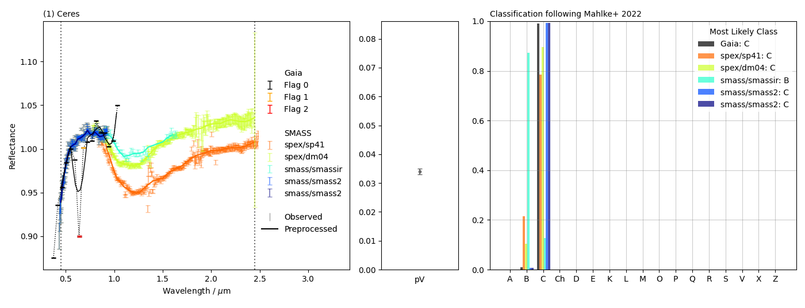
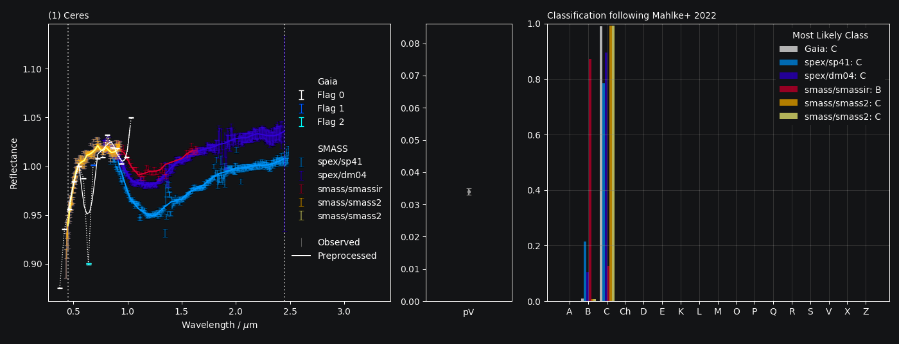

##########
``classy``
##########

.. |br| raw:: html

      

.. raw:: html

    

.. role:: gray

A ``python`` tool to classify asteroid reflectance spectra in the framework of the
asteroid taxonomy presented in `Mahlke, Carry, and Mattei 2022
<https://arxiv.org/abs/2203.11229>`_ and to compare with spectra in
public repositories (e.g. Gaia, SMASS, MITHNEOS).\ [#f1]_

:ref:`Take a guided tour through the documentation here. <Install>`

.. :ref:`Take a guided tour through the documentation <Install>` or click on a
.. topic below to learn more.
..
.. .. highlight:: python
..
.. |br|
.. :octicon:`beaker;1em` **Taxonomic classification of reflectance spectra.**
..
.. .. grid:: 2
..
..     .. grid-item-card::
..       :link: getting_values
..       :link-type: ref
..
..       Classify your own and public observations.
..
..
..     .. grid-item-card::
..       :link: thermal_barbarians
..       :link-type: ref
..
..       Visualize the classification results and store them to file.
..
.. |br|
..
.. :octicon:`telescope;1em` **Quick query and download of reflectance spectra in public repositories**.
..
..
.. .. grid:: 2
..
..     .. grid-item-card::
..       :link: name_resolution
..       :link-type: ref
..
..       Quick look-up and visualization of public spectra in different repositories.
..
..
..     .. grid-item-card::
..       :link: aliases
..       :link-type: ref
..
..       Automatic ingestion of relevant metadata such as flags and bibliographic
..       references.
..
.. |br|
..
.. :octicon:`zap;1em` **And more!**
..
.. .. grid:: 2
..
..     .. grid-item-card::
..       :link: who
..       :link-type: ref
..
..       Automatic retrieval of most-likely visual albedo to improve classification
..       accuracy.
..
..     .. grid-item-card::
..       :link: author
..       :link-type: ref
..
..       Are my spectra available through ``classy``?

.. rubric:: Footnotes
   :caption:

.. [#f1] Latest version: 0.3.7  - `What's new? <https://github.com/maxmahlke/classy/blob/master/CHANGELOG.md>`_  | Comment, bug or feature request? Open an issue on `GitHub <https://github.com/maxmahlke/classy/issues>`_.

.. toctree::
   :maxdepth: 2
   :caption: Contents
   :hidden:

   Home<self>
   Install<getting_started>
   Public Data<data>
   Adding Your Data<core>
   Classifying Asteroids<taxonomy>
   Taxonomic Systems<taxonomies>
   Tutorials<tutorial>
.. glossary
