.. _preprocessing:

Preprocessing
=============

``classy`` offers basic preprocessing functionality for reflectance spectra:
smoothing, truncating, normalising, resampling, and slope removal. They are demonstrated
here using a spectrum of (402) *Chloe* from DeMeo+ 2009.

.. code-block:: python

  >>> import classy
  >>> spectra = classy.Spectra("Chloe", shortbib="DeMeo+ 2009")
  >>> spec = spectra[0]  # There is only one spectrum matching these criteria
  >>> spec.plot()

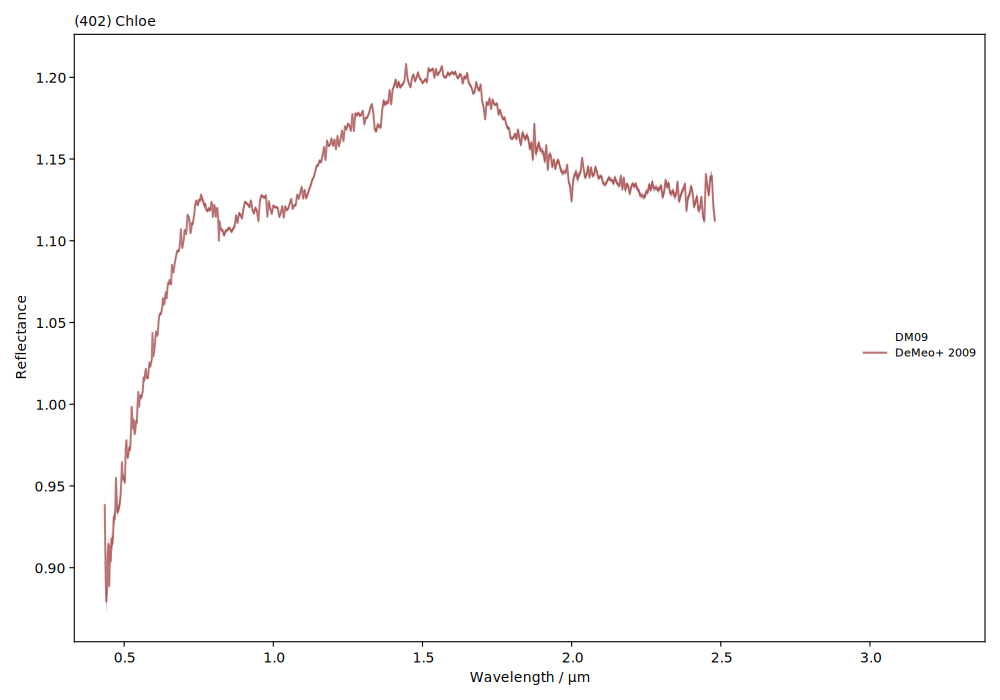

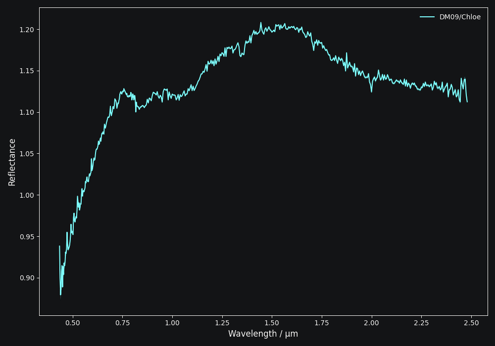

Smoothing
---------

Smoothing a spectrum aims to reduce high-frequency noise in the data. To smooth
a spectrum, use the ``smooth()`` method. Two common smoothing algorithms are
supported:

- Savitzky-Golay: Applies a smoothing filter using `scipy.signal.savgol_filter
  <https://docs.scipy.org/doc/scipy/reference/generated/scipy.signal.savgol_filter.html>`_

- Spline Fit: Applies smoothing using `scipy.interpolate.UnivariateSpline
  <https://docs.scipy.org/doc/scipy/reference/generated/scipy.interpolate.UnivariateSpline.html>`_

The main argument of ``smooth()`` is the ``method``, which is either ``savgol`` or ``spline``.
All other arguments provided to ``smooth()`` are passed to the underlying
smoothing function given above.

.. code-block:: python

    >>> spec.smooth(method='savgol', window_length=7, polyorder=3)  # arguments passed to scipy.signal.savgol_filter

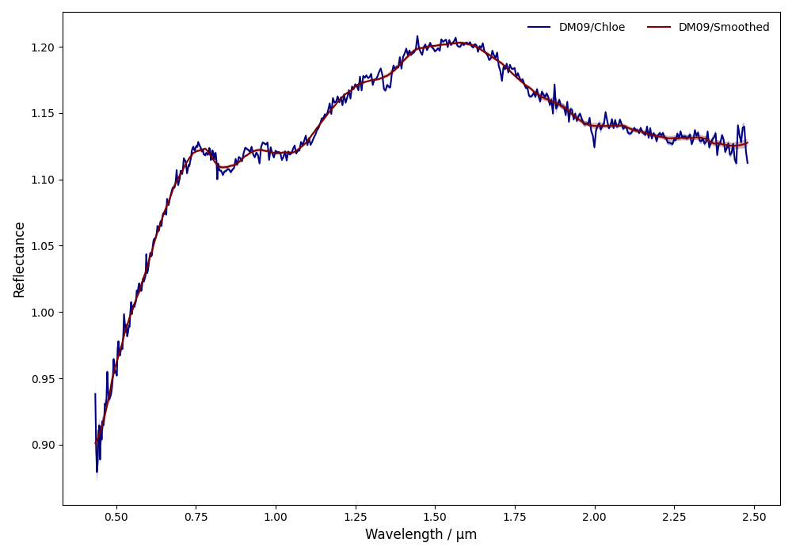

.. image:: gfx/preprocessing/chloe_smoothed_dark.png
 :align: center
 :class: only-dark
 :width: 600

The choice of smoothing parameters is often a tedious iterative process
(smooth, plot, smooth, plot, ...). ``classy`` facilitates this process by
providing an interactive graphical user interface, allowing to adjust the
parameters while inspecting the result in real time. Calling ``smooth()``
without any arguments launches the smoothing interface.

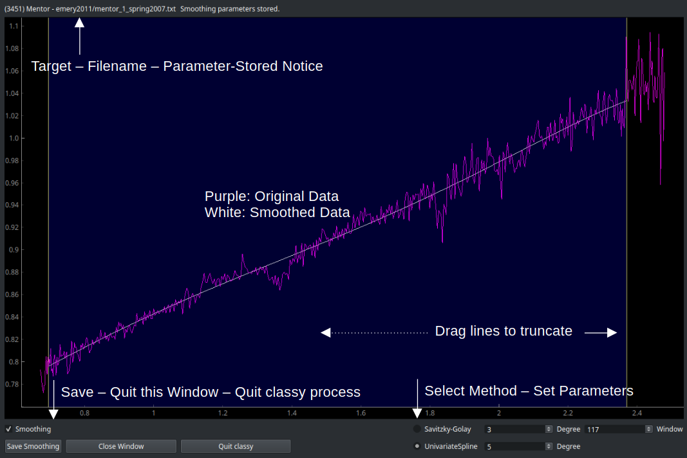

After storing the smoothing parameters, ``classy`` will automatically apply them
the next time that the ``smooth()`` function is called, without opening the interface.

This way, smoothing spectra prior to analysis is quick and only done once. To smooth a batch
of spectra using the smoothing interface, you can use these methods:

.. tab-set::

  .. tab-item:: Command Line

    Smooth all spectra in Marsset+ 2014.

    .. code-block:: shell

      $ classy smooth --shortbib 'Marsset+ 2014'

    This will launch the smoothing interface for all spectra which have not been
    smoothed yet. You can use the ``--force`` flag to also smooth spectra that
    have already been smoothed. The syntax to select spectra is documented :ref:`here <selecting_spectra>`.

  .. tab-item:: python

    Smooth all spectra in Marsset+ 2014.

    .. code-block::  python

      >>> spectra = classy.Spectra(source='Marsset+ 2014')
      >>> spectra.smooth()

    This will launch the smoothing interface for all spectra which have not been
    smoothed yet. You can use the ``force=True`` argument to also smooth spectra that
    have already been smoothed. The syntax to select spectra is documented :ref:`here <selecting_spectra>`.

.. important::

  The original spectrum data file is never changed by ``classy``. All preprocessing transformations
  are applied in memory.

Normalising
-----------

Two normalisation methods can be applied to a ``classy.Spectrum``:

- ``wave``: normalise a spectrum to unity ``at`` a given wavelength by division
- ``l2``: set the L2-norm of the spectrum to unity

Normalisation is applied using the ``.normalize`` method. The ``method``
keyword accepts one of the two method names given above. The default
is ``wave`` and requires to define the wavelength at which to normalise
using the ``at`` argument. ``classy`` then normalises the spectrum to
unity in the wavelength bin which is the closest to the provided ``at``
value.

.. code-block:: python

    >>> spec.normalize(method='l2')  # normalises L2-norm to unity
    >>> spec.normalize(at=1.25)  # normalises to unity at closest existing wavelength point

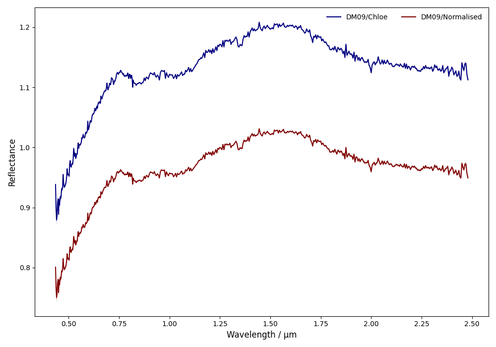

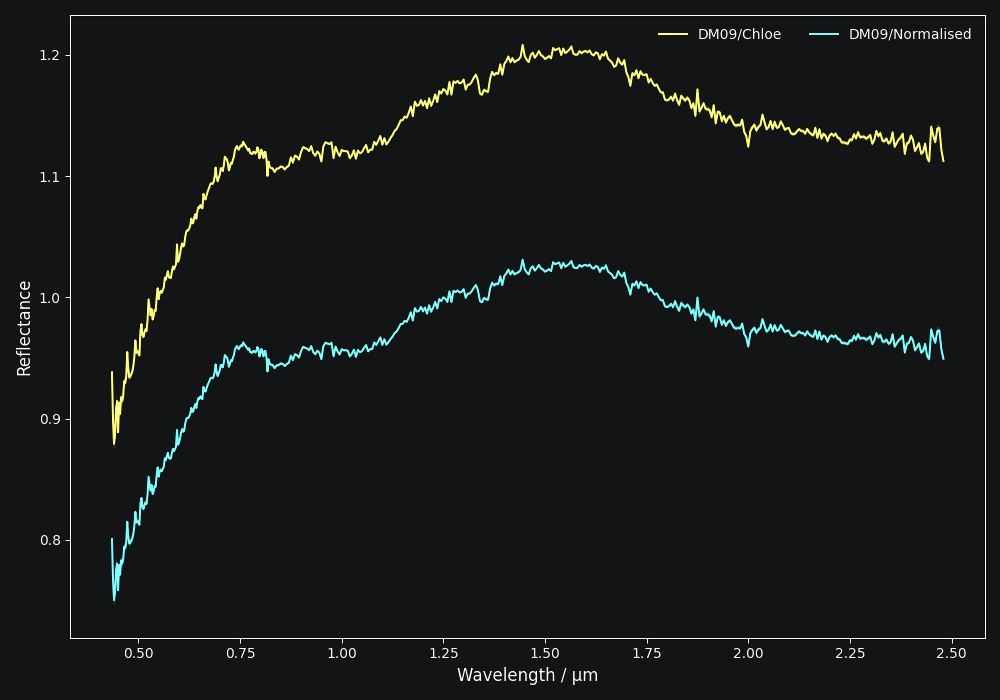

Resampling
----------

Resampling a ``classy.Spectrum`` can be used for extrapolation or for
homogenisation of the sampling different spectra. The ``.resample()`` method
uses `scipy.interpolate.interp1d
<https://docs.scipy.org/doc/scipy/reference/generated/scipy.interpolate.interp1d.html>`_.
The function takes a list of wavelengths at
which to resample the spectrum. All other arguments are passed on to the
``scipy.interpolate.interp1d`` function.

.. code-block:: python

  >>> wave_new = classy.taxonomies.demeo.WAVE  # resample to DeMeo+ 2009 wavelength pattern
  >>> spec.resample(wave_new)

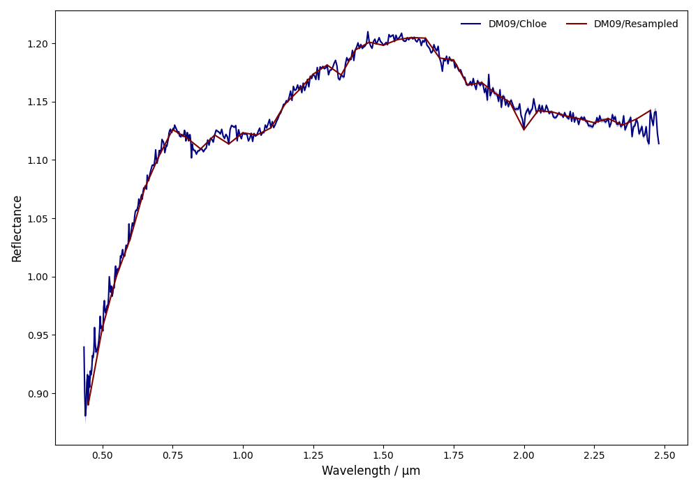

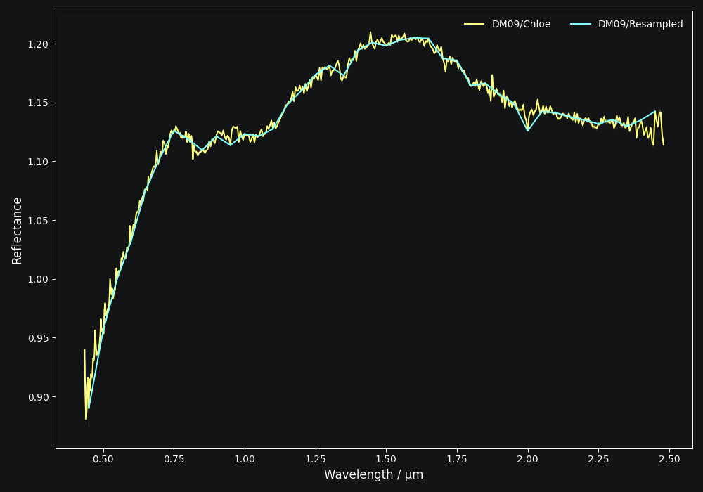

The following
example shows how to do linear and constant extrapolation. You can find more
information in the documentation of `scipy.interpolate.interp1d
<https://docs.scipy.org/doc/scipy/reference/generated/scipy.interpolate.interp1d.html>`_.

.. code-block:: python

   >>> spec.resample(wave_new, fill_value='extrapolate') # linear extrapolation
   >>> spec.resample(wave_new, bounds_error=False, fill_value=(spec.refl[0], spec.refl[-1]) # constant extrapolation.

.. warning::

   Resampling changes the shape of the wavelength and reflectance arrays (``spec.wave`` and ``spec.refl``).
   The reflectance error ``spec.refl_err`` cannot be resampled, meaning that it would keep its original shape.
   This can cause trouble in various places in ``classy``. The error attribute is therefore set to ``None``
   when resampling.

Truncating
----------

Use the ``truncate()`` to quickly set the upper and lower wavelength bounds
of the spectrum by specifying one or both of ``wave_min`` and ``wave_max``.

.. code-block:: python

   >>> spec.truncate(wave_min=0.9)

.. image:: gfx/preprocessing/chloe_truncated.png
 :align: center
 :class: only-light
 :width: 600

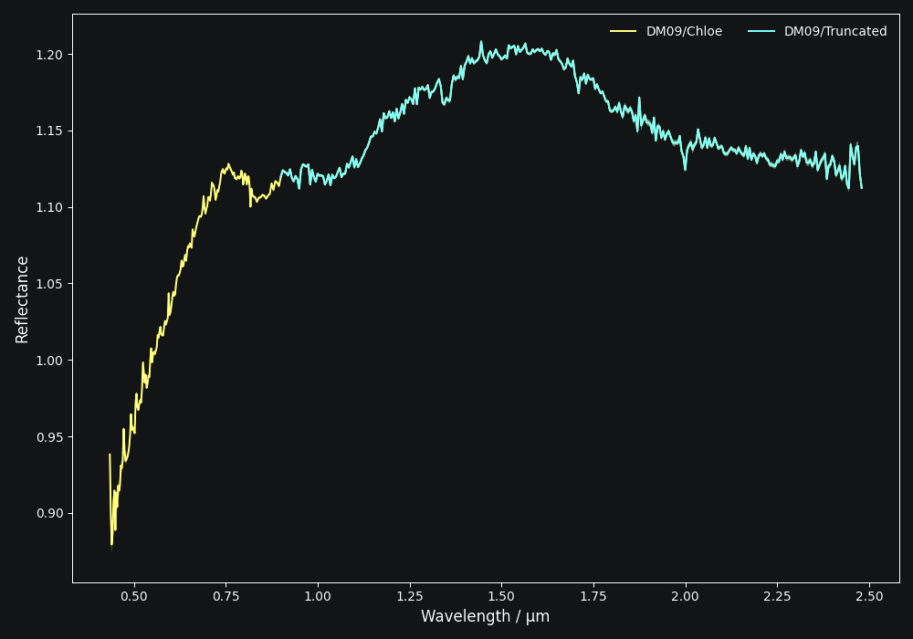

.. note::

   Unlike resampling, truncating does retain the reflectance error as the operation
   can be applied to the ``spec.refl_err`` array as well.

Remove Slope
------------

Removing the slope of a spectrum means fitting a polynomial of degree 1 to the
entire spectrum and to divide the reflectance values by the best-fit line. The
intercept and slope of the fit solution are accessible via the added ``slope``
attribute of the spectrum:

.. code-block:: python

  >>> spec.remove_slope()
  >>> spec.slope # tuple containing (slope, intercept) of fitted polynomial
  (0.06839286, 1.02706994)

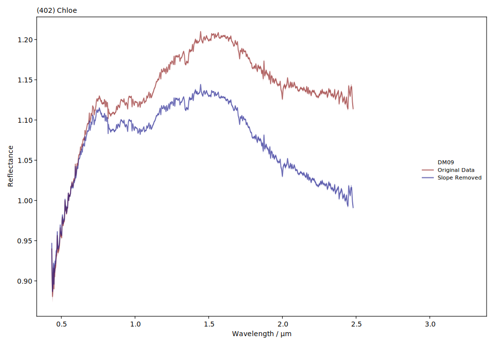

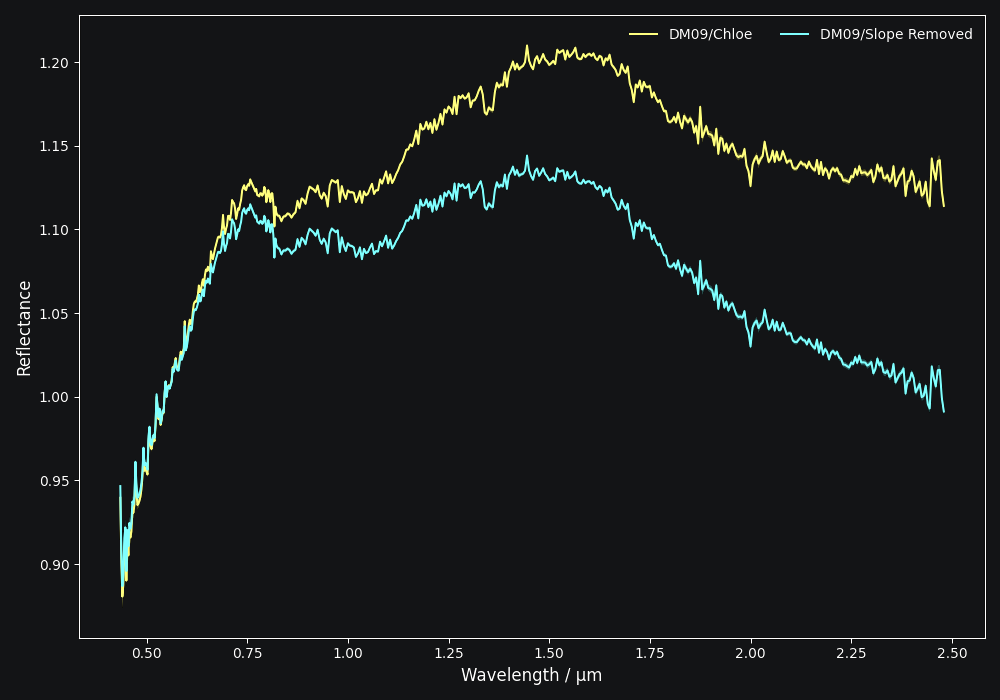

Remove Continuum
------------

Removing the continuum of a spectrum means fitting a convex hull to the spectrum and dividing the reflectance values by the continuum.
The reflectance will be overwritten. Use spectra._refl_original to get the original reflectance.

.. code-block:: python

  >>> spec  = classy.Spectra(16)[-2]
  >>> spec.remove_continuum() 

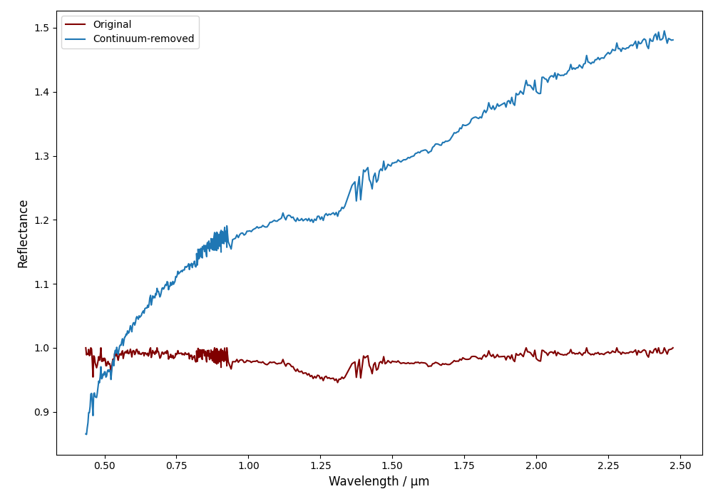

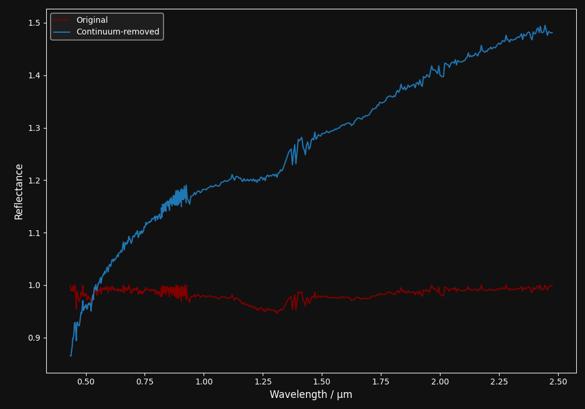

