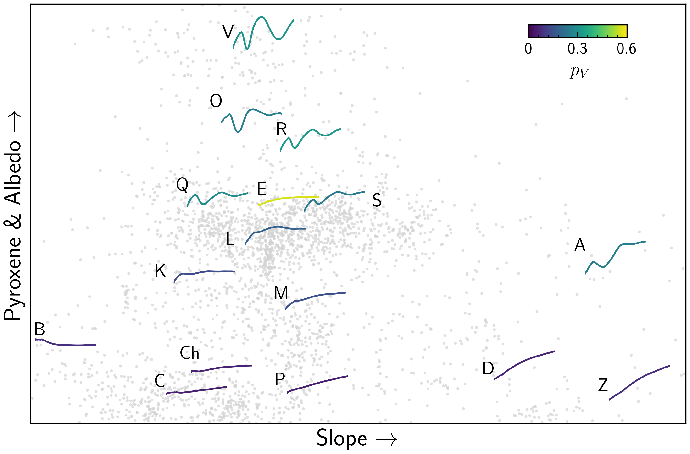
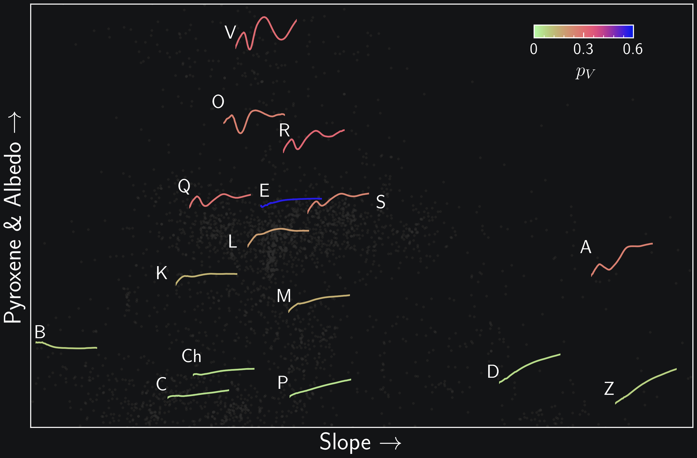
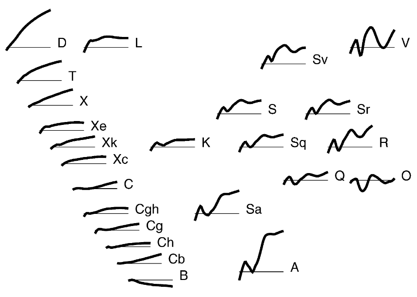
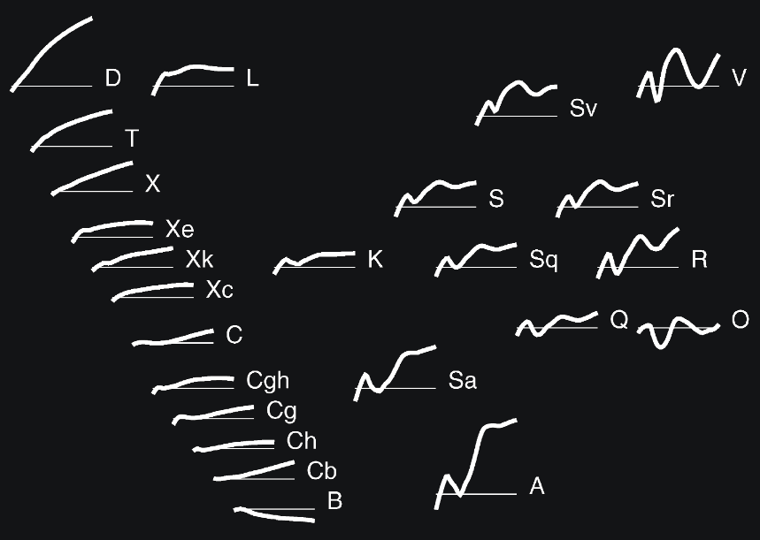

.. _available_taxonomies:

Taxonomic Systems
=================

``classy`` is developed to facilitate the application of the `Mahlke+ 2022
<https://arxiv.org/abs/2203.11229>`_ taxonomy to asteroid reflectance spectra.
Nevertheless, it can also be used to classify observations in three other
systems: `Tholen 1984
<https://ui.adsabs.harvard.edu/abs/1984PhDT.........3T/abstract>`_, `Bus and
Binzel 2002 <https://ui.adsabs.harvard.edu/abs/2002Icar..158..146B/abstract>`_,
`DeMeo+ 2009
<https://ui.adsabs.harvard.edu/abs/2009Icar..202..160D/abstract>`_. The main properties of all four
systems are summarized below, focusing on their applicability to data with given properties.

For an in-depth overview of the history of asteroid taxonomies, you can have a look `at this timeline <https://raw.githubusercontent.com/maxmahlke/maxmahlke/main/docs/mahlke_taxonomy_timeline.pdf>`_.

Mahlke+ 2022
------------

+-------------------+------------------------------------------+
| Observables       | Reflectance Spectra, Visual Albedo       |
+-------------------+------------------------------------------+
| Wavelength Range  | 0.45-2.45µm, or any subset of this range |
+-------------------+------------------------------------------+
| Number of Classes |                                          |
+-------------------+------------------------------------------+
| Class Assignment  | Probabilistic                            |
+-------------------+------------------------------------------+

The three main advantages of the Mahlke+ 2022 taxonomies are the large number
of observables (visible and near-infrared spectra and the visual albedo),
the ability to classify partial observations (e.g. visible-only spectra), and the probabilistic
classification results (e.g. 70% S, 30% A).

.. tab-set::

  .. tab-item:: Command Line

      .. code-block:: bash

          $ classy spectra ceres --classify

      .. image:: gfx/ceres_classification.png
         :align: center
         :class: only-light
         :width: 600

      .. image:: gfx/ceres_classification_dark.png
         :align: center
         :class: only-dark
         :width: 600

  .. tab-item :: python

     .. code-block:: python

       >>> import classy
       >>> spectra = classy.spectra("ceres")
       >>> for spec in spectra:
       ...     spec.classify() # system="Mahlke+ 2022" is the default
       >>> classy.plotting.plot_spectra(spectra, add_classes=True)

Preprocessing
+++++++++++++

Classification
++++++++++++++

DeMeo+ 2009
-----------

This classification uses the PCA+decision tree from DeMeo rather than comparing
the spectra to the templates via chi2.

Note that the implementation here is based on the principal components analysis
and the decision tree outlined in DeMeo+ 2009 rather than using a Chi2
comparison to the class templates.

Preprocessing
+++++++++++++

The preprocessing of observations requires resampling, removing the slope, and
normalizing to 0.55µm.

Classification
++++++++++++++

Sidenote: The missing data mean
+++++++++++++++++++++++++++++++

As DeMeo+ 2009 demeaned the reflectance spectra prior to the PCA, **the same
mean value** of each reflectance bin has to subtracted from new reflectance
spectra to be projected into the same principal space. I could not find the
original mean values in the source publication\ [#f1]_, so I computed it myself
using the spectra from DeMeo+ 2009 and give it here for completeness:

.. code-block:: python

   [0.8840578, 0.94579985, 1.04016798, 1.07630094, 1.10387232, 1.10729138,
    1.07101476, 1.02252107, 0.99167561, 0.98766575, 1.00292349, 1.02223844,
    1.04660108, 1.07201578, 1.08967345, 1.10014259, 1.11101667, 1.12359452,
    1.13128556, 1.13642896, 1.13467689, 1.12810013, 1.11471935, 1.09802574,
    1.07842635, 1.06127665, 1.04536074, 1.03360292, 1.02395605, 1.01587389,
    1.01034821, 1.00915786, 1.01078308, 1.01245031, 1.01298133, 1.01314109,
    1.01236654, 1.01140562, 1.01090655, 1.00955344]

Note that this is not the exact mean as I did not have the original spectra of
(41) *Daphne*, (82) *Alkmene*, and (3788) *Steyaert*. However, compared to the
published scores, I get an average difference of 0.0003 using scores I compute
with this data mean, which is sufficiently accurate for any purposes.

Classes
+++++++

PCA
Reflectance spectra
Complete between 0.45 to 2.45
25 classes

Bus and Binzel 2002
-------------------

PCA
Reflectance spectra
Complete between 0.45 to ?
22 classes

Tholen 1984
-----------

`Tholen 1984 <https://ui.adsabs.harvard.edu/abs/1984PhDT.........3T/abstract>`_
derived a milestone taxonomy consisting of 14 classes based on 405 asteroids
observed in the framework of the `Eight Color Asteroid Survey
<https://ui.adsabs.harvard.edu/abs/1985Icar...61..355Z/abstract>`_. It uses
ultraviolet and visible colours as well as the visual albedo.

+-------------------+------------------------------------+
| Observables       | Reflectance Spectra, Visual Albedo |
+-------------------+------------------------------------+
| Wavelength Range  | 0.337 - 1.041µm                    |
+-------------------+------------------------------------+
| Number of Classes | 14                                 |
+-------------------+------------------------------------+
| Class Assignment  | Absolute                           |
+-------------------+------------------------------------+

.. tab-set::

  .. tab-item:: Classes

    .. image:: gfx/tholen1984_classes.png
       :align: center
       :class: only-light
       :width: 800

    .. image:: gfx/tholen1984_classes_dark.png
       :align: center
       :class: only-dark
       :width: 800

  .. tab-item :: Data Transformation

    Tholen 1984 applied standardization to the ECAS colours prior to computing the PCA.
    The same standardization has to be applied to new observations to classify them in the Tholen scheme.
    This requires the mean and standard deviation of the 405 asteroids in the seven ECAS colours Tholen used.
    These values are given in Table II of Tholen 1984:

    .. code-block:: python

       ecas_mean = {
       "s-v": 0.325,
       "u-v": 0.234,
       "b-v": 0.089,
       "v-w": 0.091,
       "v-x": 0.105,
       "v-p": 0.103,
       "v-z": 0.111,
       }

       ecas_std = {
       "s-v": 0.221,
       "u-v": 0.173,
       "b-v": 0.092,
       "v-w": 0.081,
       "v-x": 0.091,
       "v-p": 0.104,
       "v-z": 0.120,
       }

  .. tab-item:: Decision Tree

    Tholen used a minimal-tree algorithm to gradually identify clusters and define
    classes. This means that not all classes have well defined boxes in the principal space
    and I have to come up with a decision tree.

    Following the minimal-tree principle, new observations asteroids are assigned to the class
    of the closest asteroid from the ECAS dataset in principal component space.
    An issue may arise for A, Q, V, which occupy a similar small volume. If you think a different
    algorithm is more appropriate, let's discuss.

    Flagging unsual or noisy data: do I keep U and :?

  .. tab-item:: Example

    Via the command line:

    .. code-block:: shell

        $ classy spectra nysa --classify --system tholen

    Via ``python``:

.. rubric:: Footnotes
   :caption:

.. [#f1] In case you found it, `let me know! <https://github.com/maxmahlke/classy/blob/master/CHANGELOG.md>`_  | Comment, bug or feature request? Open an issue on `GitHub <https://github.com/maxmahlke/classy/issues>`_
