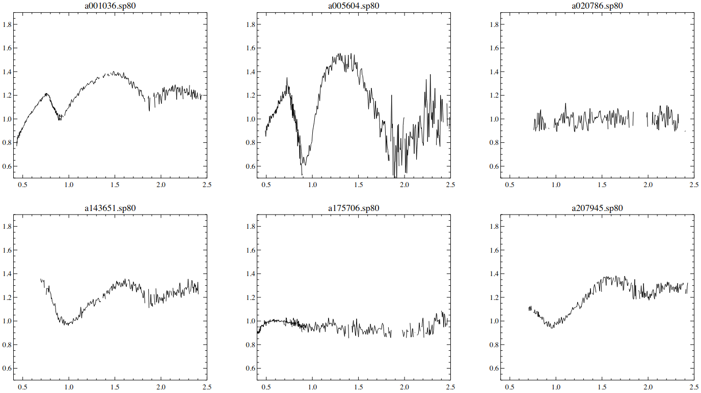

########
Tutorial
########

This tutorial shows how to classify a set of spectral observations with ``classy``.
There are generally two ways to use ``classy``: via the :term:`CLI` or via the
``python`` package interface.

.. contents:: In this Tutorial

Input Data
==========

The example data is the `sp80 <http://smass.mit.edu/catalog.php>`_
observation run of the `MITHNEOS <http://smass.mit.edu/home.html>`_ survey using the SpeX instrument.

  Spectra acquired during the sp80 observations run by the MITHNEOS survey using the SpeX instrument.

There are six files, one for each spectrum, following the format of

.. code:: bash

   wavelength reflectance  uncertainty    flag
    0.4350    0.8303       0.0115         1
    0.4375    0.8738       0.0107         1
    0.4400    0.8572       0.0095         1
    0.4425    0.8531       0.0084         1
    0.4450    0.8670       0.0076         1
                     [...]
    2.4350   -1.0000      -1.0000         0
    2.4400   -1.0000      -1.0000         0
    2.4450    1.2442       0.0041         4
    2.4500    1.2504       0.0042         4
    2.4550   -1.0000      -1.0000         0

Format of Spectrometric Data
----------------------------

We ignore the uncertainty and flag columns in the following. ``classy`` expects the input to
be transposed, i.e. the wavelength as columns and the reflectance of a single spectrum as row. This way,
we can merge several spectra into a single file, as shown below.

.. code:: bash

   0.45    0.46    0.47    0.48    0.49    [...]  2.41    2.42    2.43    2.44    2.45    name
   0.8635  0.8686  0.8942  0.8853  0.9057  [...]     NaN     NaN  1.1621  1.2014  1.2000  Ganymed
      NaN     NaN     NaN     NaN     NaN  [...]     NaN     NaN  1.2814  1.3453  1.2500  2003 QO104
      NaN     NaN     NaN     NaN     NaN  [...]     NaN     NaN     NaN  0.9129  1.0000  2000 RG62
      NaN     NaN     NaN     NaN  0.9020  [...]  1.1680  0.9714     NaN  1.0905  1.1083  1992 FE
   0.9666  0.9671  0.9524  1.0051  0.9817  [...]  1.0338  1.0367  1.0620  1.0242  0.9799  1996 FG3
      NaN     NaN     NaN     NaN     NaN  [...]  1.2687  1.2311  1.3234  1.2392  1.2927  1991 JW

``NaN`` represent missing values in the spectra. You can download the CSV file of the merged spectra `here <https://github.com/maxmahlke/classy/blob/main/docs/data/sp80.csv>`_.

Format of Albedo Data
---------------------

The :term:`taxonomy <Taxonomy>` accounts for the visual albedo of minor bodies
and it is generally recommended to add this value prior to classification in
order to get more accurate results. The visual albedo has to be in a column called ``pV``.
Shown below is the format of the ``sp80.csv`` CSV file after adding the visual albedo with ``rocks``.

.. code:: bash

   0.45    0.46    [...]  2.44    2.45    name           number     pV     ref_pV
   0.8635  0.8686  [...]  1.2014  1.2000  Ganymed        1036       0.253  2022PSJ.....3...56H;2015Icar..256..101H
      NaN     NaN  [...]  1.3453  1.2500  2003 QO104     143651     0.132  2011AJ....141..109M;2010AJ....140..770T
      NaN     NaN  [...]  0.9129  1.0000  2000 RG 62     20786      NaN                                        NaN
      NaN     NaN  [...]  1.0905  1.1083  1992 FE        5604       0.436               2003Icar..166..116D; [...]
   0.9666  0.9671  [...]  1.0242  0.9799  1996 FG3       175706     0.044                      2011MNRAS.418.1246W
      NaN     NaN  [...]  1.2392  1.2927  1991 JW        207945     0.161                      2011ApJ...743..156M

Optional: Add visual albedo values with ``rocks``
-------------------------------------------------

One way to add the visual albedo is using the `rocks <https://github.com/maxmahlke/rocks>`_ interface to the `SsODNet <https://vo.imcce.fr/webservices/ssodnet/>`_ service.

.. code:: python

   import pandas as pd
   import rocks

   # Read in the data
   data = pd.read_csv("sp80.csv")

   # For each spectrum in the data...
   for index, row in data.iterrows():

       # Get the ssoCard of the respective asteroid
       asteroid = rocks.Rock(row['name'])

       # If a visual albedo value exists for this asteroid
       if asteroid.albedo:

           # Add the visual albedo and its bibliographic reference to the data
           data.loc[index, 'pV'] = asteroid.albedo.value
           data.loc[index, "ref_pV"] = ";".join(
               bibref.bibcode for bibref in asteroid.albedo.bibref
           )

       # Add the current IAU name and number of the asteroid to the data
       data.loc[index, 'name'] = asteroid.name
       data.loc[index, 'number'] = asteroid.number

    # Save the updated data
    data.to_csv("sp80_with_pV.csv", index=False)

Preprocessing
=============

The input data has to be preprocessed as outlined in the :term:`manuscript` and in the flowchart below.
