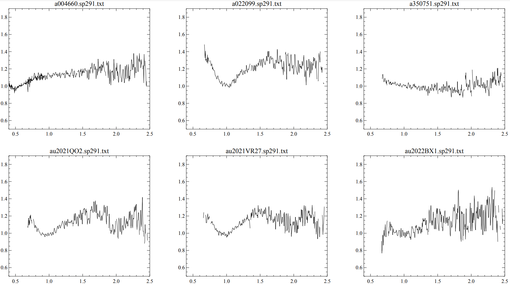
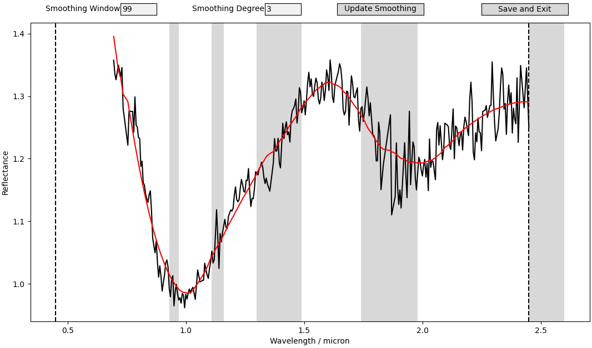
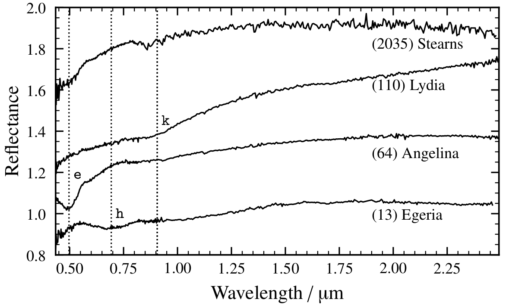

########
Tutorial
########

This tutorial shows how to classify a set of spectral observations with ``classy``.
There are generally two ways to use ``classy``: via the :term:`CLI` or via the
``python`` interface.

.. contents:: In this Tutorial

Input Data
==========

The example data is the `sp291 <http://smass.mit.edu/catalog.php>`_
observation run of the `MITHNEOS <http://smass.mit.edu/home.html>`_ survey using the SpeX instrument,
which at the time of this writing is the most recent data uploaded to the SMASS
website. This data has not been used to train the ``classy`` clustering.

  Spectra acquired during the sp291 observations run by the MITHNEOS survey using the SpeX instrument.

There are six files, one for each spectrum, following the format of

.. code:: bash

   wavelength reflectance  uncertainty    flag
    0.4350    0.8303       0.0115         1
    0.4375    0.8738       0.0107         1
    0.4400    0.8572       0.0095         1
    0.4425    0.8531       0.0084         1
    0.4450    0.8670       0.0076         1
                     [...]
    2.4350   -1.0000      -1.0000         0
    2.4400   -1.0000      -1.0000         0
    2.4450    1.2442       0.0041         4
    2.4500    1.2504       0.0042         4
    2.4550   -1.0000      -1.0000         0

We ignore the uncertainty and flag columns in the following.

Format of Spectrometric Data
----------------------------

``classy`` expects the input to be transposed, i.e. the wavelength as columns
and the reflectance of a single spectrum as row. The wavelengths at which the
spectra were observed have to be given as column headers. This way, we can
merge several spectra into a single file, as shown below. Note that the file
content below is formatted for readability, ``classy`` expects a ``csv`` file,
i.e. comma-separated columns.

.. code:: bash

   0.45    0.46   0.47   0.48   0.4    [...]   2.41    2.42    2.43    2.44    2.45  designation
   0.987  0.978  0.977  0.963  0.938   [...] 1.0366  1.2312  1.2955  1.1523  0.9963         4660
     NaN    NaN    NaN    NaN    NaN   [...] 0.9606  0.8803  1.1017     NaN  1.2474     2021 QO2
     NaN    NaN    NaN    NaN    NaN   [...] 1.0661  1.0962  1.1209  1.1617     NaN       350751
     NaN    NaN    NaN    NaN    NaN   [...]    NaN     NaN  1.1391  1.0983  1.2120    2021 VR27
     NaN    NaN    NaN    NaN    NaN   [...] 1.2404  1.3313  1.0860     NaN  1.3307     2022 BX1
     NaN    NaN    NaN    NaN    NaN   [...] 1.1894  1.1573     NaN  1.0399  1.0352        22099

``NaN`` represent missing values in the spectra. You can download the ``csv`` file of the merged spectra `here <https://github.com/maxmahlke/classy/blob/main/docs/data/sp291.csv>`_.

Format of Albedo Data
---------------------

The :term:`taxonomy <Taxonomy>` accounts for the visual albedo of minor bodies
and it is generally recommended to add this value prior to classification in
order to get more accurate results. The visual albedo has to be in a column called ``pV``.
Shown below is the format of the ``sp291.csv`` ``csv`` file after adding the visual albedo with ``rocks``.

.. code:: bash

   0.45    0.46 [...]   2.44    2.45        name    number     pV                                   ref_pV
   0.987  0.978 [...] 1.1523  0.9963      Nereus      4660  0.550                      2003Icar..166..116D
     NaN    NaN [...]    NaN  1.2474    2021 QO2       NaN    NaN                                      NaN
     NaN    NaN [...] 1.1617     NaN     2002 AW    350751    NaN                                      NaN
     NaN    NaN [...] 1.0983  1.2120   2021 VR27       NaN    NaN                                      NaN
     NaN    NaN [...]    NaN  1.3307    2022 BX1       NaN    NaN                                      NaN
     NaN    NaN [...] 1.0399  1.0352  2000 EX106     22099  0.307  2016AJ....152...63N;2011AJ....141..109M

Optional: Add visual albedo values with ``rocks``
-------------------------------------------------

One way to add the visual albedo is using the `rocks <https://github.com/maxmahlke/rocks>`_ interface to the `SsODNet <https://vo.imcce.fr/webservices/ssodnet/>`_ service.

.. code:: python

   import pandas as pd
   import rocks

   # Read in the data
   data = pd.read_csv("sp291.csv")

   # For each spectrum in the data...
   for index, row in data.iterrows():

       # Get the ssoCard of the respective asteroid
       asteroid = rocks.Rock(row.designation)

       # If a visual albedo value exists for this asteroid
       if asteroid.albedo:

           # Add the visual albedo and its bibliographic reference to the data
           data.loc[index, 'pV'] = asteroid.albedo.value
           data.loc[index, "ref_pV"] = ";".join(
               bibref.bibcode for bibref in asteroid.albedo.bibref
           )

       # Add the current IAU name and number of the asteroid to the data
       data.loc[index, 'name'] = asteroid.name
       data.loc[index, 'number'] = asteroid.number

    # Save the updated data
    data.to_csv("sp291.csv", index=False)

Preprocessing
=============

The input data has to be preprocessed as outlined in the :term:`manuscript` and
in the flowchart below.

[Placeholder for Flowchart]

Smoothing Parameters for Input Spectra
--------------------------------------

The spectroscopic data is smoothed and resampled to a uniform wavelength grid. The smoothing is done using a `Savitzky-Golay <https://en.wikipedia.org/wiki/Savitzky–Golay_filter>`_ filter,
which requires two parameters: the ``smooth_window`` and the ``smooth_degree``. The parameters largely depend on the noise and the original sampling pattern of the input data.
Both parameters are integer values. Note that the ``smooth_window`` has to be odd, larger than ``smooth_degree``, and smaller than the number of observed wavelength bins.

By default, ``classy`` launches a plot of each input spectrum which allows to interactively set the best smoothing parameters.

  Interface for interactive smoothing of asteroid spectra. The original data is
  shown in black, the smoothed spectrum in red. Gray regions show wavelength
  bands where telluric absorption lines commonly lead to noisy spectral regions
  or artificial reflectance drop-offs.

The original spectrum is shown in black, the smoothed spectrum is shown in red.
The smoothing parameters are entered into the textboxes. You can update the smoothed spectrum
by pressing ``Enter`` / ``Return`` when in the textbox or using the ``Update Smoothing`` button. The smoothing parameters
are saved and the plot is exited using the ``Save and Exit`` button. If the smoothed spectrum in the plot does not update, check your terminal
for an error message. The most likely case is that the entered smoothing parameters are not valid.

Alternatively, the parameters can be provided to the preprocessing routine by adding columns of the same name to the input data and setting the value for each spectrum.
The interactive spectrum plots are then skipped.

In the following, we use data where the smoothing parameters are not set before.

Feature Recognition in Input Spectra
------------------------------------

The final classification of observations may depend on the presence or absence of features, specifically the ``e``, ``h``, or ``k`` features.

  Examples of the e, h, and k feature. Figure from `Mahlke, Carry, and Mattei 2022 <https://arxiv.org/abs/2203.11229>`_.

These features are relevant for the classes ``B``, ``C``, ``P``, ``M``, ``E``, and ``X``.
For each input observation classified in any of these classes, ``classy`` will run an automatic feature-recognition algorithm.
The band-fits can then be confirmed or adjusted using an interactive plot which is opened for each band fit as shown below.

[Placeholder for feature-fitting plot]

The automatic fitting can be accepted without visual inspection by using the ``skip-validation`` argument. However, this is generally not recommended.

Via the :term:`CLI`
-------------------

The preprocessing steps can be executed by calling the ``classy`` executable and pointing it at the input data in ``csv`` format.

.. code:: bash

   $ classy preprocess sp291.csv

One by one, interactive plots of the input spectra are opened.
After all spectra have been smoothed, the preprocessed data is saved to file in
the same directory as the input data, with the same filename except for an
added ``_preprocessed`` suffix.

.. code:: bash

   $ classy preprocess data/sp291.csv
   INFO     Stored preprocessed data to data/sp291_preprocessed.csv

Via the `python` interface
--------------------------

.. code:: python

   import classy

   path_data = "path/to/data.csv"

   preprocessor = classy.preprocessing.Preprocessor(path_data)
   preprocessor.preprocess()
   preproccessor.to_file()

Classification
==============

The input observations are classified by computing their latent scores and cluster probabilities
followed by a decision tree to derive the most probable class, as outline in the :term:`manuscript`.

Via the :term:`CLI`
-------------------

The classification steps can be executed by calling the ``classy`` executable and pointing it at the preprocessed data in ``csv`` format.

.. code:: bash

   $ classy classify sp291_preprocessed.csv

The classified data is saved to the same directory as the input data, with the same filename except for an added ``_classified`` suffix.
If the input filename has a ``_preprocessed`` suffix, it is replaced by the ``_classified`` suffix.

.. code:: bash

   $ classy classify sp291_preprocessed.csv
   INFO     Looks like we got 2 S, 1 Ee, 1 B, 1 X, 1 Q
   INFO     Stored classified data to data/sp291_classified.csv

If the ``-p|--plot`` flag is set, a plot of the input data, its cluster and class probabilities, as well as its distribution in the latent space is opened after classification.

.. code:: bash

   $ classy classify --plot sp291_preprocessed.csv
   INFO     Looks like we got 2 S, 1 Ee, 1 B, 1 X, 1 Q
   INFO     Stored classified data to data/sp291_classified.csv

.. figure:: gfx/sp291_classified.png
  :width: 800
  :alt: Classification results of MITHNEOS observation run sp291.

  Classification results of MITHNEOS observation run sp291. Top middle: raw data, with the visual albedos shown
  by the filled circles on the right with an offset of 1 (i.e. the black sample has an albedo of about 0.6). Top right: The probability per sample to belong to either of the
  50 clusters. Middle right: The probability per sample to belong to either of the 17 classes. Remaining plots: Distribution of the classified samples in the latent space, with the original classy
  data as gray background distribution.

Via the `python` interface
--------------------------

.. code:: python

   import classy

   path_data = "path/to/data_preprocessed.csv"
   classifier = classy.classify.Classifier(path_data)
   classifier.classify()

   # Optionally
   classifier.plot()

   classifier.to_file()
